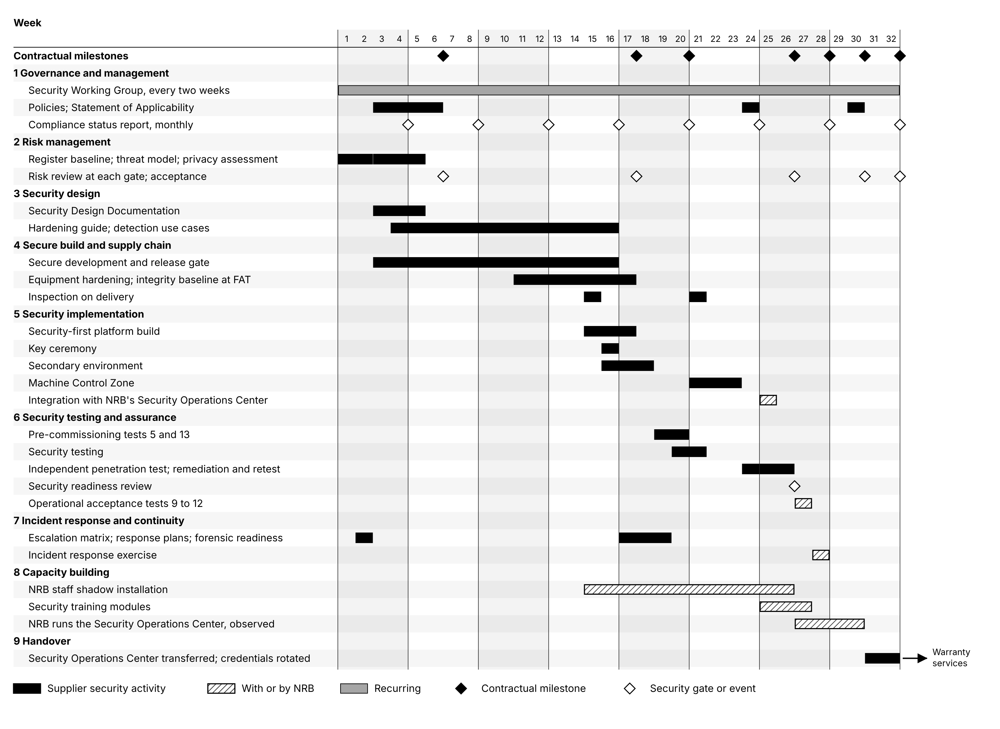

# 9. Resources, Schedule and Capacity Building

## 9.1 Cybersecurity work breakdown structure

| Work package | Main deliverables | Weeks and lead |
|---|---|---|
| 1. Governance and management | Security Working Group; policies; monthly compliance reports | Weeks 1 to 32; Cybersecurity and PKI Specialist |
| 2. Risk management | Risk register; threat model; Privacy Impact Assessment; risk acceptance at handover | Weeks 1 to 32; Cybersecurity and PKI Specialist |
| 3. Security design | Security Design Documentation; hardening guide; detection rules | Weeks 3 to 17; Solution Architect |
| 4. Secure build and supply chain | Release gate records; equipment hardening and integrity baseline; delivery inspection | Weeks 3 to 21; Software Integration Specialist |
| 5. Security implementation | Hardened platform and security stack; key ceremony; secondary environment; Machine Control Zone; integration with NRB's Security Operations Center | Weeks 15 to 25; Network Engineer and CPF Infrastructure Engineer |
| 6. Security testing | Pre-commissioning tests 5 and 13; security test report; penetration test and retest; operational acceptance tests 9 to 12 | Weeks 19 to 27; Quality Assurance and Testing Specialist |
| 7. Incident response and continuity | Incident Response Plan; Business Continuity Response Plan; exercise report | Weeks 2 to 28; Cybersecurity and PKI Specialist |
| 8. Capacity building | Shadowing; security training; Security Operations Center run by NRB under observation | Weeks 15 to 30; Training and Change Management Specialist |
| 9. Handover | Transfer of the Security Operations Center; credential rotation; as-built security documentation | Weeks 31 to 32; Cybersecurity and PKI Specialist |

## 9.2 Timeline

*Figure 9.1: Cybersecurity timeline by work package, against the ten contractual milestones of the
Information System schedule in Preliminary Project Plan Section 2.2. Solid bars are the Supplier's
work; hatched bars are performed with or by NRB; open diamonds are security gates and events.*

## 9.3 Resource and skill matrix

| Role | Leads | Contributes to |
|---|---|---|
| Cybersecurity and PKI Specialist | Governance and risk; PKI and key management; monitoring and incident response; security testing; knowledge transfer | Network security; application security; equipment control systems |
| Solution Architect | Security architecture and design | Risk assessment; PKI; application security; testing |
| Network Engineer | Network zones, firewalls and intrusion prevention | Monitoring; Machine Control Zone; testing |
| CPF Infrastructure Engineer | Hardened platform, secondary environment, backup and recovery | Monitoring; key management infrastructure; testing |
| Software Integration Specialist | Secure development and interface security | PKI for interface certificates; testing |
| Secure Personalization System Engineer | Equipment control systems, with the manufacturer | Knowledge transfer |
| Quality Assurance and Testing Specialist | Security test programme and traceability | Risk assessment |
| Training and Change Management Specialist | Security training delivery | |
| Supplier security engineers | Security monitoring and on-call response until handover | Testing; knowledge transfer |
| Independent penetration tester | Penetration testing | |

| Role | Qualifications | Engagement |
|---|---|---|
| Cybersecurity and PKI Specialist, proposed for the Cyber Security Expert position | Degree in cybersecurity, computer science or information security; experience with hardware security modules, encryption and certificates | Weeks 1 to 32, on site from week 15; then Level 2 security support through the warranty period |
| Network Engineer | CCNA and CCNP; at least five years on firewalls and secure government networks | Design; weeks 15 to 23 |
| Supplier security engineers | Experience in security monitoring and incident response | Weeks 16 to 32 |
| Independent penetration tester | Independent of the Supplier; CREST accredited or equivalent | Week 24, retest in weeks 25 and 26, then annually |

The qualifications of the other roles are set out in the Key Personnel CVs.

## 9.4 Capacity building and knowledge transfer

The aim is that NRB operates the facility's security without the Supplier at handover, and has already
done so under observation. Three security engineers are trained for two posts, under the Training
Sub-Plan in Preliminary Project Plan Section 3.

| Activity | Participants |
|---|---|
| Shadowing of the security build, the key ceremony and the security tests, weeks 15 to 26 | NRB security engineers and administrators |
| Security administration module, two days, weeks 26 and 27 | Security engineers, system administrators |
| Security and compliance module, weeks 25 and 26 | All users, and managers |
| Incident response exercise, week 28 | Security engineers, administrators, NRB security officer |
| Security Operations Center run by NRB under observation, weeks 27 to 30 | Security engineers |

**Transfer criteria.** The Security Operations Center is transferred once each NRB security engineer
has shown, under observation, that they can classify and escalate alerts, apply the playbooks of
Section 7.3 to containment, run an access recertification, operate the hardware security modules
under dual control, restore a server from the immutable backups, and produce the monthly compliance
report.
