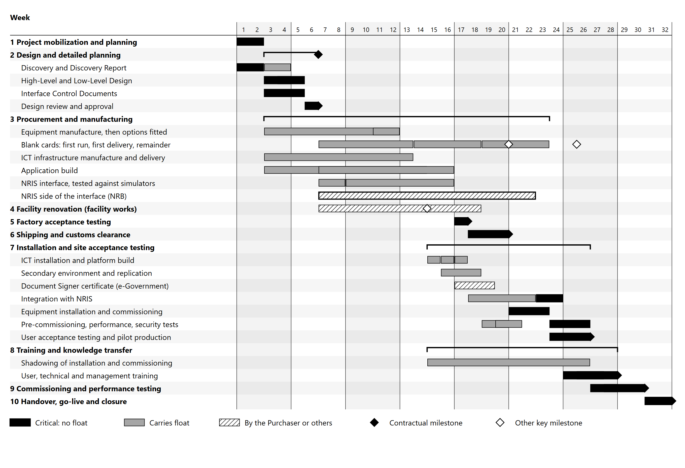

# 2. Implementation Sub-Plan

## 2.1 Methodology and phases

Implementation follows the ten contractual milestones as phases. Each phase ends at a defined
output, and a phase that feeds the next is not closed until its output has been accepted.

| # | Phase | Weeks | Contractual milestone | Information System outputs |
|---|---|---|---|---|
| 1 | Mobilization and planning | 1 to 2 | | Team mobilized, Purchaser inputs confirmed, schedule baselined, long-lead equipment and ICT infrastructure ordered |
| 2 | Design and detailed planning | 3 to 6 | Detailed Design Approval | High-Level and Low-Level Design, Interface Control Documents, future-state processes, card layout and card identifier, ICT site preparation requirements, network requirements for the Government Wide Area Network |
| 3 | Procurement and manufacturing | 7 to 16, with manufacture from week 3 | | Equipment manufactured and fitted with the options fixed at design approval, ICT infrastructure delivered, application software built, production side of the NRIS interface built against simulators, blank cards manufactured |
| 4 | Facility renovation | 7 to 18 | | Delivered under the facility works. Dependencies for the Information System: the server room handed over in week 14, and the production floor ready for installation in week 18 |
| 5 | Factory acceptance testing | 17 | Successful FAT | Equipment accepted at the factory on the actual card stock, Printer Control Service proven against the equipment software, NRB technical staff trained at the factory |
| 6 | Shipping and customs clearance | 18 to 20 | Equipment delivered on site | Equipment and the first card delivery on site |
| 7 | Installation and site acceptance testing | 21 to 26, with the ICT installation from week 15 | Installation and SAT complete | System installed and integrated, secondary environment operational, Document Signer key established, pre-commissioning tests passed, pilot production run |
| 8 | Training and knowledge transfer | 25 to 28 | Training completed | User, technical and management training under Section 3 |
| 9 | System commissioning and performance testing | 27 to 30 | System commissioned | Operational acceptance tests passed under Section 4 |
| 10 | Handover, go-live and closure | 31 to 32 | Full handover and go-live | As-built documentation, prepared progressively from week 27, operation of the Security Operations Center transferred, stabilization support, Operational Acceptance |

**Workstreams.** Within the phases the work runs in six workstreams, each with a single lead:

| Workstream | Scope | Lead |
|---|---|---|
| Personalization and mailing equipment | Manufacture, factory acceptance, installation and commissioning of two laser personalization systems and two mailing and dispatch systems | Equipment manufacturer, under the Supplier |
| Application software | Card Personalization Management System, Data Preparation Service, Signing Service, Printer Control Service, Quality Control Management, Mailing and Dispatch Management System, Stock Control, monitoring and administration | Supplier |
| NRIS integration | Interface specification, production-side development, integration testing | Supplier, with NRB developers building the NRIS side |
| ICT infrastructure | Virtualization hosts, storage array, network, firewalls, hardware security modules, backup, workstations, secondary environment | Supplier |
| Security | Security controls, establishment of the Document Signer key with e-Government, Security Operations Center | Supplier |
| Polycarbonate cards | Card body design with NRB, manufacture, qualification on the laser systems, phased delivery | Card manufacturer, under the Supplier |

**Where the workstreams join.** Four points bind them together, and each is a scheduled event
rather than an assumption: design approval in week 6, where every workstream's design is reviewed
as one; factory acceptance in week 17, where the equipment, the application's interface to it and
the card stock meet for the first time; integration from week 18, where the application meets NRIS;
and pilot production in week 26, where every workstream has to work at once.

## 2.2 Schedule

The Implementation Schedule leaves the delivery date of each line for the Proposer to specify.
The Information System's delivery against each line is as follows. Weeks are counted from the
Effective Date, and week 1 is the first week after it.

| Line | Subsystem or item | Delivery | Installation | Acceptance | Liquidated damages milestone |
|---|---|---|---|---|---|
| 1 | Project mobilization and planning | Week 1 | Week 1 | Week 2 | |
| 2 | Design and detailed planning | Design submitted for approval, week 5 | Week 3 | Week 6 | Detailed Design Approval |
| 3 | Procurement and manufacturing | Equipment ready for factory acceptance, week 12 | Week 7 | Week 16 | |
| 4 | Facility renovation | Under the facility works | Week 7 | Week 18 | |
| 5 | Factory acceptance testing | Week 17 | Week 17 | Week 17 | Successful FAT |
| 6 | Shipping and customs clearance | On site, week 20 | Week 18 | Week 20 | Equipment delivered on site |
| 7 | Installation and site acceptance testing | ICT estate installed, week 17. Equipment installed, week 23. Pre-commissioning complete, week 26 | Week 21 | Week 26 | Installation and SAT complete |
| 8 | Training and knowledge transfer | Week 28 | Week 25 | Week 28 | Training completed |
| 9 | System commissioning and performance testing | Week 30 | Week 27 | Week 30 | System commissioned |
| 10 | Handover, go-live and closure | Week 32 | Week 31 | Week 32 | Full handover and go-live |

*Figure 2.1: Information System schedule, summary. Black bars carry no float; hatched bars are work by
the Purchaser or other parties; black diamonds are the contractual milestones.*

**Two lines start ahead of their contractual week.** Nothing in the Contract requires work to wait
for the start of its line, and starting earlier is how the schedule gains float without moving a
milestone. Equipment manufacture begins on order in week 3 rather than in week 7, because only the
options depend on the approved design, and they are fitted after approval. The ICT installation
begins in week 15, when the server room is handed over, rather than waiting for the equipment in week
21, because the servers and the personalization equipment are separate supplies in separate rooms.

**The critical path.** Three chains have no float, and each is fixed by a contractual date:

| Chain | Why it has no float |
|---|---|
| Design approval in week 6, NRB's side of the interface to week 22, completion of integration in weeks 23 and 24, then pre-commissioning, pilot production and operational acceptance | Integration cannot finish before NRB's side is ready, and everything after it runs to the Installation and SAT milestone in week 26 |
| Factory acceptance in week 17, shipping and customs to week 20, equipment installation in weeks 21 to 23, equipment pre-commissioning to week 26 | Factory acceptance is fixed in week 17 and installation and SAT in week 26, and the work between them fills the interval |
| Training in weeks 25 to 28, leading to operational independence in week 28 | The training window is fixed by the Contract, and operational independence must be shown before the final demonstration begins |

The first is the one that runs through work outside the Supplier's control, which is why the NRIS
side is followed as closely as the Supplier's own work, with a joint checkpoint every two weeks and
each interface integrated as soon as it is delivered. The float created by starting manufacture early
sits before factory acceptance: it protects the week 17 date, but cannot shorten what follows it.
Design in weeks 1 to 6 and the handover in weeks 31 and 32 also carry no float, since each fills the
interval to its contractual milestone.

**Float on the other chains.** Every other chain can slip by the float shown without moving a
milestone:

| Chain | Needed by | Float |
|---|---|---|
| Equipment ready for factory acceptance | Week 17 | Four weeks, finishing in week 12 on the assumed ten week manufacturing time |
| Document Signer certificate issued by e-Government | Week 26, for pilot production | Six weeks, with the certificate signing request in week 16 |
| First card delivery on site | Week 26, for pilot production | Five weeks. The factory acceptance stock is made in a separate first run |
| All 2,000,000 cards on site | Week 27, before commissioning | One week |
| Server room handed over | Week 15, for the ICT installation | Five weeks. A later handover moves the ICT track, which carries the same float, and no milestone |
| Secondary environment at Blantyre | Week 26 | Five weeks |
| Production floor ready for installation | Week 21, for the equipment installation | Two weeks |

**The operational acceptance window is tight by design.** The operational acceptance tests fill
weeks 27 to 30, and the final acceptance demonstration requires continuous production over an
agreed observation period. The plan is built on an observation period of ten working days in weeks
29 and 30. A longer period would move the commissioning milestone, which is why the observation
period is among the decisions requested at design approval in Section 2.7.

## 2.3 Discovery and information gathering

Discovery runs from week 1 into the first half of design, and establishes the facts the design
depends on before any of it is written.

| Area | What is established | Method |
|---|---|---|
| NRIS data | Where each field the card requires is held, its type, length and permitted values, how it behaves when absent, and how the photograph and signature are stored | Data dictionary review with NRB, then profiling of the NRIS test data |
| NRIS interfaces | The existing middleware connection to the database, the application programming interface NRB plans, authentication, and the status values the document tracker expects | Walkthrough with NRB developers |
| Data quality | The proportion of records complete enough to produce a card, photographs meeting ICAO specifications, name lengths against the card layout, and characters used in Chichewa text | Profiling of the NRIS test data against the draft validation rules |
| Current production and dispatch | How requests are released today, how completed cards are batched and dispatched to ordering offices, and how the document tracker and SMS notification are updated | Walkthrough at NRB with the staff who perform each step |
| Security and PKI | The e-Government certificate profile, certificate signing request procedure and issuing time | Working sessions with e-Government and NRB |
| Network | Government Wide Area Network capacity and latency between the Card Production Facility, NRIS and the Blantyre disaster recovery data center | Working session with NRB and e-Government, followed by measurement |
| Site | Equipment and server room positions on the floor plan, and access routes for delivery | Joint review with the facility works |

**Why profiling comes before design rather than after.** Validation rules written against a data
dictionary describe the data as it was specified. Profiling the test data describes it as it is. A
name longer than the card layout allows, a photograph that fails ICAO checks, or a field left empty
in a large share of records is a design decision, not a defect to be found in pilot production. The
Discovery Report records every such finding and the decision taken on it.

**Output.** A Discovery Report in week 4, covering each area above, the decisions it requires, and
the Purchaser inputs still outstanding against the dates in Section 2.7.

## 2.4 Design and process re-engineering

**Design deliverables.** Design runs in weeks 3 to 6 and is submitted for approval in week 5.

| Deliverable | Content |
|---|---|
| High-Level Design | Architecture, components and their interfaces, deployment across the primary and secondary environments, and the security architecture |
| Low-Level Design | Host, storage, network and database configuration, virtual machine allocation, IP addressing, VLANs, firewall policy, and the hardened baselines |
| Interface Control Documents | Every NRIS exchange: transport, operations, message structures, field definitions, schemas, error conditions and status values, agreed with NRB developers |
| Security Design Documentation | Controls, access model, key management, the Document Signer key procedure and certificate profile agreed with e-Government, and logging |
| Card layout and card identifier | The card layout produced with NRB in the joint redesign, the positions of variable data, the QR zone and the card identifier used on the mailing line, and the blank card numbering scheme, format and range for the Purchaser's approval |
| ICT Site Preparation Guide | What the facility works must provide for the Information System: floor positions, loads, power per position, heat load, clearances, cable routes and server room layout |
| Network requirements | Bandwidth, latency and firewall openings required on the Government Wide Area Network, for the Purchaser to provision |

The ICT Site Preparation Guide is issued first, in week 4, because the facility works begin in
week 7, build the server room first, and must build it to the guide. Everything else is completed together and reviewed with NRB as one
design, so that an interface agreed with NRIS and a firewall rule in the Low-Level Design cannot
disagree.

**Process re-engineering.** The Information System changes how cards move from request to dispatch.
Each change is designed as a process, with its roles, controls and procedures, rather than left to
be discovered by operators after go-live:

| Process | Future state |
|---|---|
| Request intake | Records released in NRIS are retrieved through a single gateway and checked against those already held, so a request cannot enter production twice. Records failing validation are held with a reason and reported back to NRIS |
| Production | Validated records are batched and assigned by an operator to either line, with automated balancing, in-line verification and in-job reproduction of rejected cards |
| Card accountability | Every blank is held against its serial number from delivery to issue or certified destruction, with reconciliation at the end of every shift |
| Mailing and dispatch | Cards are matched with carriers by card identifier, enveloped and batched by ordering office for dispatch |
| Status | Each defined status is published back to NRIS automatically, where it drives the document tracker and the SMS notification to the cardholder |

**Outputs.** Future-state process maps, the roles and separation of duties for each process, and
draft Standard Operating Procedures. The procedures are refined through pilot production and become
the operator training material under Section 3.

**Approval.** The design is presented to NRB in week 5 and approved in week 6. Where the review
changes the design, the change is made before approval rather than carried as an open action into
the build.

## 2.5 Build, installation and integration

**Build, weeks 3 to 16.**

| Activity | Weeks | Detail |
|---|---|---|
| Equipment manufacture | 3 to 12 | Two personalization systems and two mailing systems, ordered in week 2 and started on their standard configuration. The options fixed at design approval are fitted in weeks 11 and 12 |
| Blank card manufacture | 7 to 23 | To the approved card design. A first run in weeks 7 to 13 produces the five thousand specimen cards used for qualification and factory acceptance, and qualification cards reach the equipment factory by week 14 so that laser parameters are set on the actual card body. The first delivery of not less than 500,000 cards follows in weeks 14 to 18 and is shipped separately from the equipment. The remaining 1,500,000 are produced in weeks 19 to 23 and delivered by week 25 in shipments of not less than 500,000, so that all 2,000,000 cards are on site before commissioning begins in week 27 |
| ICT infrastructure | 3 to 13 | Ordered at mobilization in the quantities set out in System Architecture Section 9.4, configured to the approved Low-Level Design, and delivered direct to site |
| Application software | 3 to 16 | The components fully defined by the Technical Requirements, which depend on neither the NRIS interface nor the QR specification, are built from week 3. The NRIS-facing and signing components follow design approval from week 7. Built in iterations, each demonstrated to NRB, and tested against NRIS interface simulators generated from the Interface Control Documents |
| NRIS side of the interface | 7 to 22 | Built by NRB developers to the same Interface Control Documents, with a joint checkpoint every two weeks |

**Factory acceptance, week 17.** The equipment is accepted at the manufacturer's factory in the
presence of the NRB delegation, on the actual blank card stock. The Printer Control Service is run
against the equipment manufacturer's personalization control software during the same visit, so the
boundary between the application and the equipment is proven before either is shipped. All data used
at the factory is synthetic.

**Installation and integration, weeks 15 to 26.** Two tracks run on site. The ICT track starts
when the server room is handed over, and the equipment track when the equipment arrives.

| Activity | Weeks |
|---|---|
| ICT infrastructure delivered, inspected on delivery and racked | 15 |
| Platform build: application and database clusters, storage array, directory, database, security stack, non-production environments | 16 |
| Hardware security module installed at the primary site. Document Signer key generated at a key ceremony witnessed by NRB, and the certificate signing request submitted to e-Government | 16 |
| Secondary environment deployed at the Blantyre disaster recovery data center, its hardware security module enrolled and the Document Signer key replicated to it, and replication established | 16 to 18 |
| Application deployed and integrated with the directory | 17 |
| Early integration with NRIS, each interface tested against the NRIS test environment as NRB delivers it | 18 to 22 |
| Pre-commissioning tests of the ICT estate, and performance and security testing | 19 to 21 |
| Equipment inspected on delivery, unpacked and placed | 21 |
| Equipment installed and commissioned by the manufacturer's engineers | 21 to 23 |
| Integration with NRIS completed against NRB's delivered side | 23 and 24 |
| Independent penetration testing of the full deployed configuration | 24 |
| Pre-commissioning tests of the equipment and integration, and user acceptance testing with NRIS stakeholders | 24 to 26 |
| Pilot production of 500 to 1,000 test cards, not issued to citizens | 26 |

**The ICT track does not wait for the equipment.** Starting it when the server room is handed over
moves integration with NRIS five weeks earlier, takes the Document Signer certificate off the
critical path, and leaves the weeks after the equipment arrives for the equipment alone. NRB
technical staff shadow both tracks from week 15.

The key ceremony is held in week 16, as soon as the module at the primary site is installed, because
the certificate it
produces has an issuing time outside the plan's control. The certificate is expected by week 19, six
weeks before pilot production needs it. The certificate signing request carries only the public key,
and the private key never leaves the modules, as described in System Architecture Section 10.4.

The secondary environment is deployed in weeks 16 to 18, so that replication has run for eight weeks
before operational acceptance tests the failover. It is deployed into the Purchaser's existing
disaster recovery data center, as described in System Architecture Section 9.3.

## 2.6 Transition to production

**From pilot to live production.** Pilot production in week 26 runs the full process on test
records against the NRIS test environment, and its cards are destroyed under the secure destruction
procedure rather than issued. Operational acceptance tests in weeks 27 to 30 also run against the
NRIS test environment, as the Responses to Queries 003 require, and their cards are not issued to
citizens. Live production on real NRIS records begins once Operational Acceptance is achieved, at the
full contractual throughput.

**One request, one facility.** While the existing card printers remain in service, a request must be
produced by one facility only. The Information System retrieves the records NRIS releases to it, and
its own check prevents a record entering its queue twice, but it cannot see what an existing printer
has already produced. The release of each request to the new facility is therefore marked in NRIS,
and the existing middleware selection excludes those records. This is agreed with NRB in the
Interface Control Documents and tested in pilot production, because a citizen issued two valid cards
is an error that surfaces only after both have been dispatched.

**Cutover.** NRB decides when requests move to the new facility, and may move them by request
type if it chooses: new issuance first, then replacements and reprints. The existing printers
remain available until the sustained production stability test has passed, so that a failure during
acceptance holds requests in NRIS rather than stopping card issuance.

**Nothing is lost if production pauses.** NRIS remains the system of record, and a request not yet
retrieved stays there. A request retrieved but not produced is held in the queue with its state. A
pause in the new facility delays cards and does not lose them.

**Stabilization.** Through the handover phase in weeks 31 and 32, resident engineers are present on
every production shift and production is reviewed daily with NRB. Support then moves to the warranty
model in Section 5, under the service levels in System Architecture Section 12.4.

## 2.7 Dependencies on the Purchaser and other parties

The plan relies on the following inputs. Each is stated with the week it is needed, meaning
available at the start of that week, so that a late input is visible as a schedule risk while there
is still time to act on it.

| Input | Provided by | Needed by | Needed for |
|---|---|---|---|
| NRIS documentation: data dictionary, message formats, authentication, database platform, existing middleware | NRB | Week 2 | Discovery and interface design |
| Access to the NRIS test environment for data profiling | NRB | Week 3 | Discovery |
| Card design decisions in the joint redesign | NRB | Week 6 | Card manufacture from week 7 |
| QR code specification: signing protocol, data format and schema, and the encryption key material where the specification requires encryption | NRB | Week 6 | Data Preparation Service and Signing Service build |
| Document Signer certificate profile and certificate signing request procedure | e-Government | Week 6 | Signing Service design |
| Decision on the observation period for the final acceptance demonstration | NRB | Week 6 | Operational acceptance schedule |
| Design review and approval | NRB | Week 6 | Contract milestone, Detailed Design Approval |
| Nomination of the factory acceptance delegation | NRB | Week 12 | Factory acceptance in week 17 |
| Dedicated electrical connection to the facility live | NRB | Week 13 | Server room handover in week 14 |
| Server room handed over: sealed, powered through its UPS, cooled and cabled, to the ICT Site Preparation Guide | Facility works | Week 15 | ICT installation from week 15 |
| Technical trainee nominations against the recommended numbers in Section 3 | NRB | Week 15 | Shadowing from week 15 |
| Government Wide Area Network provisioned to the stated requirements at the Card Production Facility and the Blantyre data center | NRB and e-Government | Week 16 | Replication from week 16 and integration from week 18 |
| Access, floor space, power and cooling for the secondary environment's rack at the Blantyre disaster recovery data center | NRB | Week 16 | Secondary environment |
| Certificates for the System's interfaces and services, including the NRIS interface | e-Government | Week 16 | Platform build and the NRIS interface |
| Documents required from the Purchaser for customs clearance of goods consigned to NRB | NRB | Week 17 | Deliveries on site in week 20 |
| Staff addresses designated for alert emails and SMS messages, by type of alert | NRB | Week 17 | Alerting configuration, tested in the pre-commissioning tests of the ICT estate |
| Connectivity from the Card Production Facility to the NRIS test environment | NRB | Week 18 | Integration and pilot production |
| Each NRIS interface, as NRB builds it | NRB developers | From week 18 | Early integration |
| Production floor ready for installation, to the ICT Site Preparation Guide | Facility works | Week 20 | Equipment installation from week 21 |
| Secure blank card store ready, sized for the full 2,000,000 cards | Facility works | Week 20 | First card delivery on site in week 20 |
| NRB Security Operations Center integration details: the product it runs, the receiving endpoint and the events required | NRB | Week 25 | Integration of the facility's Security Operations Center with NRB's |
| User trainee nominations against the recommended numbers in Section 3 | NRB | Week 20 | Training from week 25 |
| NRIS side of the interface complete and ready for integration | NRB developers | Week 23 | Completion of integration |
| Document Signer certificate issued | e-Government | Week 26 | Pilot production in week 26 |
| Remote support access arrangement | NRB and e-Government | Week 26 | Warranty support |

The inputs among these on which the System's design relies are also set out in System Architecture
Section 13.1.

## 2.8 Responsibility assignment

**R** responsible for doing the work, **A** accountable for its completion, one per activity,
**C** consulted before it is done, **I** informed of the outcome.

| Activity | Supplier | Equipment manufacturer | Card manufacturer | Facility works | NRB | e-Government |
|---|---|---|---|---|---|---|
| Discovery and NRIS data analysis | A, R | I | | C | C | |
| High-Level and Low-Level Design | A, R | C | | C | C | I |
| Card layout and card identifier | A, R | C | R | | C | |
| ICT Site Preparation Guide | A, R | C | | C | I | |
| Interface Control Documents | A, R | | | | R | |
| NRIS side of the interface | C | | | | A, R | |
| Application software build | A, R | C | | | I | |
| Equipment manufacture and factory acceptance | A | R | C | | C | |
| Blank card manufacture and delivery | A | | R | | I | |
| Qualification of the card body on the laser systems | A | R | R | | I | |
| Server room handover | C | | | A, R | I | |
| Production floor ready for installation | C | C | | A, R | I | |
| Shipping, customs clearance and delivery | A, R | C | C | | C | |
| ICT infrastructure installation and platform build | A, R | | | C | I | |
| Equipment installation and commissioning | A | R | | C | I | |
| Secondary environment at Blantyre | A, R | | | | C | |
| Government Wide Area Network provisioning | C | | | | A, R | R |
| Document Signer key ceremony and certificate signing request | A, R | | | | C | I |
| Document Signer certificate issue | C | | | | I | A, R |
| Integration and user acceptance testing | A, R | | | | R | |
| Pre-commissioning tests and pilot production | A, R | R | | | C | |
| Training delivery | A, R | R | | | C | |
| Operational acceptance tests | R | C | | | A | |
| Handover and transfer of Security Operations Center operation | A, R | | | | C | |

Operational acceptance is shown as the Purchaser's, because the Purchaser performs those tests with
the Supplier's assistance under the Contract. Approval of contract deliverables rests with the
Project Manager and is not repeated against each activity.

## 2.9 Implementation risks and mitigation

Likelihood and impact are rated high, medium or low. Each risk has one owner, and the register is
reviewed at every progress meeting from week 1.

| ID | Risk | Likelihood | Impact | Mitigation | Owner |
|---|---|---|---|---|---|
| R1 | The NRIS side of the interface is not complete when integration must finish in weeks 23 and 24 | Medium | High | Interface Control Documents agreed at design approval; production side proven against simulators from week 7; each interface integrated as NRB delivers it from week 18; joint checkpoint every two weeks; the approved database connection described in System Architecture Section 7.5 available as a fallback where the Purchaser approves it | Supplier, with NRB |
| R2 | The Document Signer certificate is not issued in time for pilot production in week 26 | Low | High | Certificate profile and procedure agreed with e-Government by week 6; key ceremony in week 16, six weeks before pilot production needs the certificate; issuing time confirmed in writing during design | Supplier, with e-Government |
| R3 | Throughput with the full personalization content falls short of 2,000 cards per hour across two lines | Medium | High | Throughput of not less than 1,000 cards per hour per machine with the full personalization content confirmed by the equipment manufacturer before order; throughput measured at factory acceptance on the actual card body; reject causes tracked from pilot production | Supplier, with the equipment manufacturer |
| R4 | The card body and the laser systems, supplied by two manufacturers, do not produce the required marking quality together | Medium | High | Qualification cards at the equipment factory by week 14; laser parameters set on the actual card body; factory acceptance run on production card stock | Supplier |
| R5 | The equipment is not ready for factory acceptance in week 17 | Low | High | Manufacture started on order in week 3, with the design options fitted after approval, giving four weeks of float; progress inspections during manufacture | Supplier, with the equipment manufacturer |
| R6 | Customs clearance extends beyond week 20 | Medium | High | Clearance documentation prepared during manufacture; clearing agent appointed by week 12; shipment arranged to arrive with time for clearance within the window; cards shipped separately with five weeks of float | Supplier |
| R7 | The server room is not handed over in week 14, or the production floor is not ready in week 20 | Medium | Medium | ICT Site Preparation Guide issued in week 4; server room built first; dedicated electrical connection needed by week 13; readiness inspection in week 18. A late server room moves the ICT track, which carries five weeks of float, and no milestone | Facility works |
| R8 | Government Wide Area Network capacity cannot sustain replication to Blantyre within the five minute lag | Medium | Medium | Network requirements issued in week 4; link measured before deployment; replication compressed and tuned; lag monitored from week 18 so a shortfall is known eight weeks before failover is tested | Supplier, with NRB and e-Government |
| R9 | NRIS records fail validation in numbers that disrupt production | Medium | Medium | Test data profiled during discovery; validation rules agreed at design; failing records held with a reason and reported to NRIS rather than printed | Supplier, with NRB |
| R10 | A request is produced by both the existing printers and the new facility during transition | Low | High | Release to the new facility marked in NRIS and excluded from the existing middleware selection; tested in pilot production | NRB, with the Supplier |
| R11 | Trained NRB staff are not available in the numbers needed for operational independence in operational acceptance | Medium | Medium | Recommended numbers and prerequisites issued in week 2; nominations by week 20; operator training completed first within the training window | NRB, with the Supplier |
| R12 | Remote access for the equipment manufacturer's specialists is not arranged by go-live | Low | Medium | Arrangement agreed with NRB and e-Government during design; resident engineers on site throughout stabilization | Supplier |

**The risk that most threatens the schedule is R1**, because the NRIS side of the interface is the
one chain in Section 2.2 without float that runs through work outside the Supplier's control. The mitigation is to agree the
interface early, prove the production side against simulators, and integrate each interface as it is
delivered, so that a late or divergent interface is visible weeks before completing integration
depends on it. R2, R5 and R7 sat on or beside the critical path; the separate ICT track and the early
start of manufacture now give each of them float.

## 2.10 Documentation deliverables

Every document the Information System requires is listed below with the week it is delivered, in the
groupings of the Technical Requirements. Each is versioned, reviewed and approved before issue under
the documentation control described in Section 4.7, and delivered in editable electronic format and
as PDF. Documentation of the facility systems, including the physical layout drawings, facility
floor plans and power and cooling design, and the electrical, UPS, generator, HVAC, fire suppression,
access control, CCTV, structured cabling and raised floor records, is delivered under the facility
works.

| Document | Content | Week |
|---|---|---|
| Project Initiation Document, Information System part | Scope, workstreams, baseline schedule, the Purchaser's inputs and their dates, risks, and the governance of the Information System workstreams | 2 |
| Discovery Report | The findings of discovery and the decisions they require, as described in Section 2.3 | 4 |
| ICT Site Preparation Guide | What the facility works must provide for the Information System, as described in Section 2.4 | 4 |
| High-Level Design | Solution architecture, network architecture and data flow diagrams, and the security architecture | 5, approved 6 |
| Low-Level Design | Detailed system design, rack elevations, IP addressing scheme, VLAN, firewall and database configuration, parameter configuration sheets and firmware versions | 5, approved 6 |
| Integration documentation | Integration Strategy and Methodology, Detailed Integration Architecture, Interface Control Documents, API Specifications, and Data Mapping and Transformation Documents; As-Built Integration Documentation covering the API, web services and middleware configuration; third-party integration procedures for the postal operator and the Government PKI | 5; 16 |
| Security documentation | Security architecture, access control matrix, user roles and permissions matrix, encryption key management and PKI procedures, audit logging configuration, and the cybersecurity hardening guide | 5; 17 |
| Database and data management documentation | Database schema, data dictionary, backup and restore, replication and archiving procedures, and data retention policies | 5; 17 |
| Acceptance Test Procedures | Factory acceptance test procedure; Pre-Commissioning Test Program; operational acceptance test procedures | 14; 17; 24 |
| Test reports | Factory, site and user acceptance test reports, integration test plans, scripts and reports, test scripts and results, performance, stress and security test reports, and defect logs with their resolutions, as described in Section 4.7 | As each test completes, 17 to 30 |
| Equipment and device manuals | Manufacturers' operation, technical, preventive maintenance and spare parts manuals for the personalization and mailing equipment and the ICT hardware | With delivery, 15 and 20 |
| Installation and configuration documents | Hardware and software installation guides and configuration manuals | With installation, 15 to 23 |
| Business continuity and disaster recovery procedures | Recovery, backup restoration and failover procedures, emergency contacts and downtime management | 19 |
| User manuals | Card personalization software, card issuance, mailing system, quality assurance and inspection, card production workflow, reporting and dashboards, and system administration | 24 |
| Standard Operating Procedures | Card production, card printing, quality verification, dispatch and mailing, consumables replacement, daily start-up and shut-down, batch processing, escalation and incident reporting | Draft 5; final 24 |
| Training materials | Training manuals, presentations, practical exercise guides, quick reference guides, laboratory manuals, and videos where the task is easier shown than described | 24 |
| Administrator training materials | Administration guides and laboratory exercise guides for the technical training | 24 |
| Operational and maintenance checklists | Daily operational, preventive maintenance, backup verification, environmental monitoring and facility inspection checklists | 24 |
| Operation and maintenance manuals | Preventive maintenance manuals, troubleshooting guides, diagnostic and system recovery procedures | 24; final 30 |
| Training records | Attendance registers, training reports and the competence matrix described in Section 3.7 | As each course completes, 25 to 28 |
| Warranty and support documentation | Warranty certificates, support escalation matrix, service level documents and manufacturer support contacts | 30 |
| Asset and inventory documentation | Equipment inventory register, serial number records, asset tagging schedule and software license inventory | 30 |
| Compliance and certification documentation | Manufacturer certifications, compliance certificates, ISO compliance documentation, security compliance reports and regulatory approvals | 30 |
| As-built documentation | As-built architecture diagrams, final network topology, final equipment placement, deviations from the approved design, and final configuration baselines | From 27; final 32 |

Operating documents are delivered in week 24, before training begins in week 25, because the
training teaches from them: an operator trained on the procedure that will be used in production
does not have to learn it a second time.
