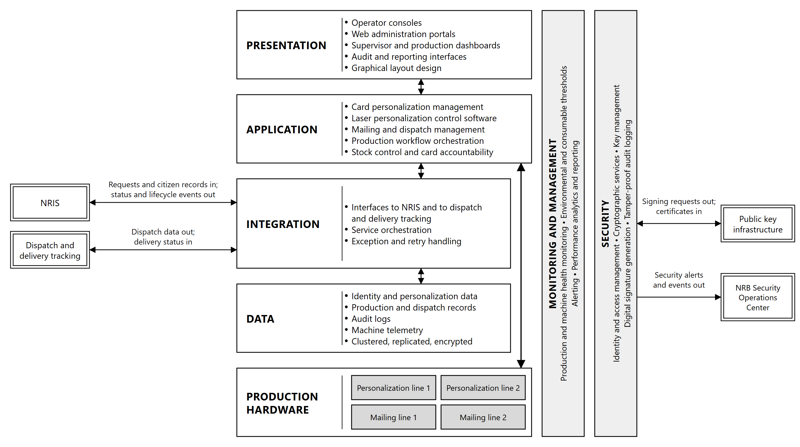
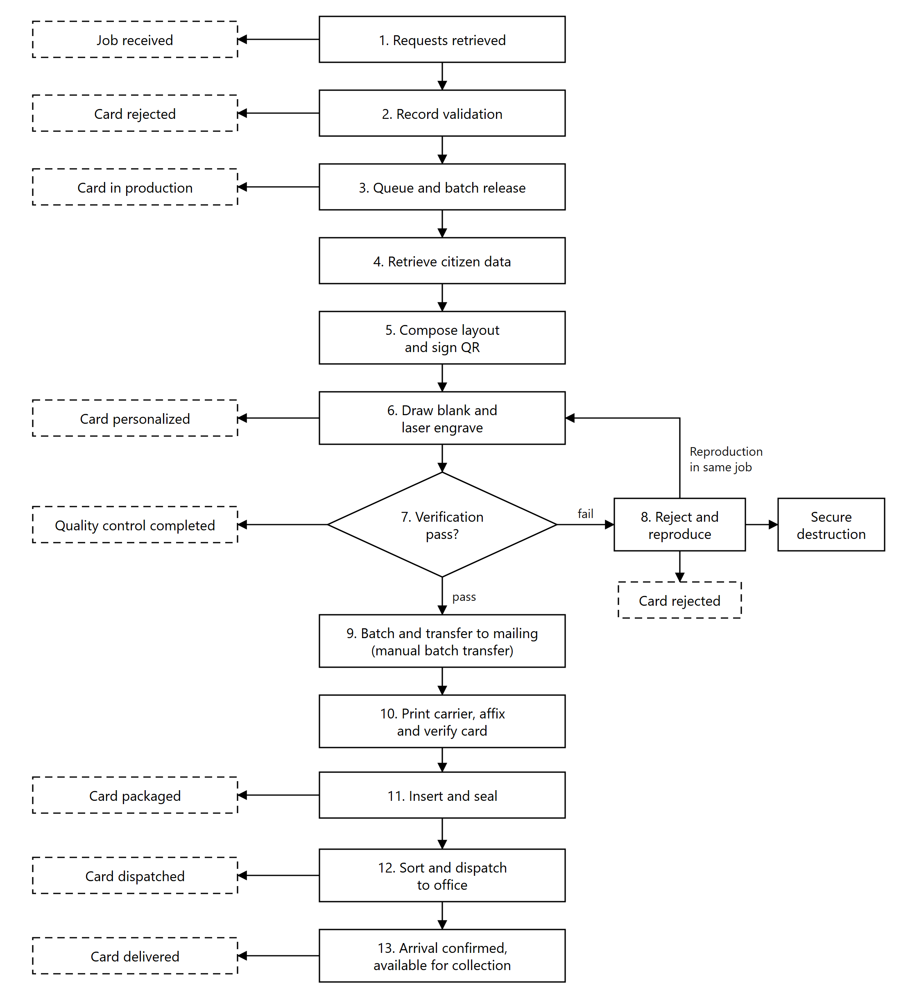
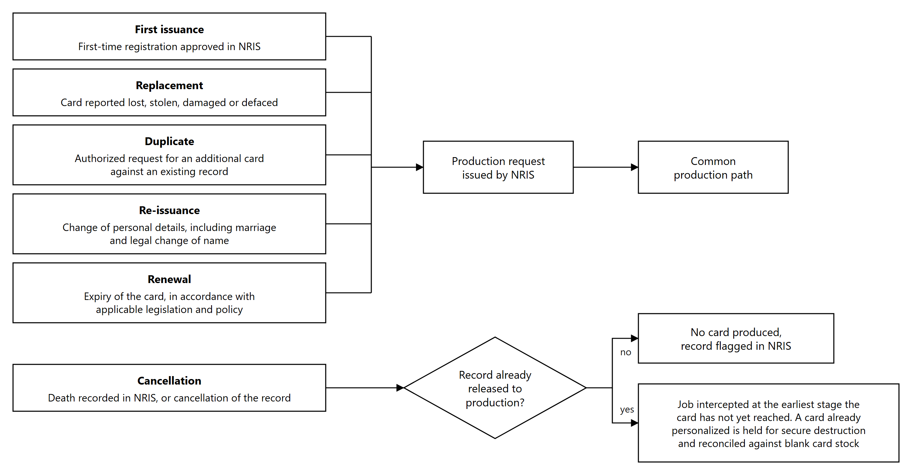

# 2. Solution Overview

## 2.1 Architecture overview

The Information System is a secure, modular, service-oriented platform organized in six logical
layers, operating two independent personalization lines and two independent mailing lines at the Card
Production Facility, with a secondary environment at the Purchaser's disaster recovery data center.

*Figure 2.1: Architecture overview. Double borders are external systems; shaded boxes are hardware.*

| Layer | Function |
|---|---|
| Presentation | Operator consoles, web administration portals, supervisor and production dashboards, audit and reporting interfaces, graphical layout design |
| Application | Card personalization management, laser personalization control software supplied by the equipment manufacturer, mailing and dispatch management, production workflow orchestration, stock control and card accountability |
| Integration | Interfaces to NRIS, with database synchronization where the Purchaser approves it; dispatch and delivery tracking and courier systems; external verification systems, through the signed QR code verified against the Government public key infrastructure; audit systems, through the synchronized audit trail and the forwarding of security events; service orchestration, exception and retry handling |
| Data | Identity and personalization data, production and dispatch records, audit logs, machine telemetry (the status, fault and counter data reported by the equipment), held in a clustered, replicated and encrypted database platform |
| Security | Identity and access management, cryptographic services, key management, digital signature generation, tamper-proof audit logging |
| Monitoring and management | Production and machine health monitoring, environmental and consumable thresholds, alerting, performance analytics and reporting |

**Production hardware.** Two automatic modular laser personalization systems and two automated
mailing and dispatch systems. Each personalization line operates independently of the other, and each
laser station within a line operates independently of the others, so that a station taken out of
service does not interrupt production, and the loss of a whole line leaves production running on the
other line.

**External interfaces.** The System exchanges data across the following external boundaries:

| Interface | Direction | Content |
|---|---|---|
| NRIS | Inbound | Card production requests; approved citizen demographic, photograph, signature and biometric records |
| NRIS | Outbound | Production status events, quality outcomes, dispatch and delivery status, card lifecycle updates, audit records |
| Dispatch and delivery tracking | Outbound | Dispatch data and tracking references for each mail piece and each dispatch batch |
| Dispatch and delivery tracking | Inbound | Dispatch progress, and confirmation that cards have reached their destination |
| Public key infrastructure | Bidirectional | Certificate signing requests for the Document Signer key, and the Document Signer certificates issued against them for the biometric QR code applied to each card |
| NRB Security Operations Center | Outbound | Security alerts, and the security events behind them |
| Alert notification | Outbound | Alert emails and SMS messages to the NRB staff designated for each type of alert |

## 2.2 End-to-end process flow

Card production runs as a single controlled sequence from the retrieval of a card production request
to the confirmation of delivery, with rejected cards reproduced within the same job, and a status
event returned to NRIS at each defined point.

*Figure 2.2: End-to-end process flow. Dashed boxes show the status events reported to NRIS.*

| Stage | Process | Status returned to NRIS |
|---|---|---|
| 1 | Card production requests, with the demographic data of each record, are retrieved from NRIS, originating from registration centers, remote sites and mobile registration equipment | Job received |
| 2 | Each record is validated for completeness and data quality. Records that fail validation are reported back to NRIS with a reason and are not released to production | Card rejected |
| 3 | Validated records are queued, assigned to a production batch and released as a personalization job | Card in production |
| 4 | The photograph, signature and biometric records of the citizens in the batch are retrieved from NRIS over an encrypted, mutually authenticated connection, and each photograph is checked against the ICAO specifications | None |
| 5 | The card layout is composed from the approved template. Variable data, the greyscale portrait, the secondary image, micro-text, the changing laser image and the biometric QR code are generated, and the QR payload is digitally signed | None |
| 6 | A blank card is drawn from controlled stock and issued to the job against its serial number, checked against the card reference, and personalized by laser engraving on both faces | Card personalized |
| 7 | Each card is verified in line for print quality, engraving quality and correct machine-readable content, against the source record | Quality control completed |
| 8 | Cards failing verification are rejected automatically and reported to the operator on screen. Reproduction takes place within the same job, and the rejected card is held for secure destruction | Card rejected |
| 9 | Accepted cards are batched and transferred to a mailing line, where each card is identified by reading the machine-readable identifier engraved on it | None |
| 10 | The personalized carrier letter is printed with the destination address and the dispatch reference, and the card is affixed. The machine reads the card and its carrier together and confirms they match, so that each card reaches the correct recipient | None |
| 11 | The carrier is folded and inserted into a window envelope, and the envelope is sealed | Card packaged |
| 12 | Mail pieces are sorted by destination and released for dispatch to the registration office that ordered them | Card dispatched |
| 13 | Arrival at the destination office is confirmed and the card is available for collection | Card delivered |

Every stage writes to a tamper-proof audit record keyed to the National Identity Number and, from the
moment a blank is drawn, to the card serial number, so that any card can be traced from the originating NRIS record through
personalization, verification, mailing and dispatch to delivery.

## 2.3 Card issuance lifecycle

The System integrates with NRIS to manage the full card lifecycle, driven by events arising in the National Identity System
and the civil registration systems it integrates.

*Figure 2.3: Card issuance lifecycle*

| Operation | Trigger | Production treatment |
|---|---|---|
| First issuance | First-time registration approved in NRIS | New card produced against a newly issued National Identity Number |
| Replacement | Card reported lost, stolen, damaged or defaced | New card produced against the existing National Identity Number, and the superseded card is flagged in NRIS |
| Duplicate | Authorized request for an additional card against an existing record | New card produced against the existing National Identity Number |
| Re-issuance | Change of personal details, including marriage and legal change of name | New card produced carrying the amended details, and the superseded card is flagged in NRIS |
| Renewal | Expiry of the card, in accordance with applicable legislation and policy | New card produced |
| Cancellation | Death recorded in NRIS, or cancellation of the record | No card produced. The record is flagged in NRIS and any card in production is withdrawn from the job |

Replacement, duplicate, re-issuance and renewal are processed on the same production path as first
issuance and are distinguished by the request type carried on the NRIS record. Card
serial numbers are unique to each physical card, so a replaced or re-issued card is traceable
independently of the National Identity Number it carries.

Where a cancellation is received for a record already released to production, the job is intercepted
at the earliest stage the card has not yet reached. Cards already personalized against a canceled
record are held for secure destruction and reconciled against the blank card stock issued.
