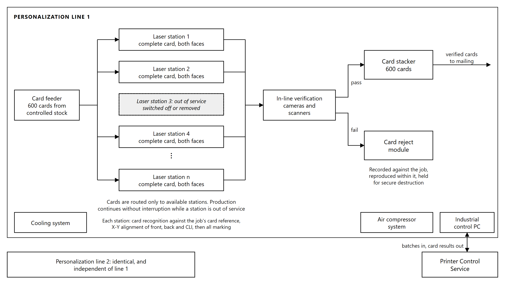

# 3. Card Personalization System

## 3.1 Configuration and modular design

Two automatic modular laser personalization systems are supplied, installed and commissioned. Each
system is a complete production line capable of personalizing a card from blank body to verified
output without reference to the other, so that the two lines can run the same job in parallel, run
different jobs concurrently, or run singly while the other is under maintenance.

Each line comprises:

| Component | Function |
|---|---|
| Card feeder | Draws blank card bodies from controlled stock into the transport path, with a 600 card capacity for continuous production |
| Card transport system | Moves cards between stations under positional control |
| Laser engraving units | Perform all marking on both faces of the card |
| Verification cameras and scanners | Read and check the personalized card in line |
| Card reject module | Diverts cards failing verification out of the production path |
| Cooling system | Maintains laser operating temperature under continuous industrial duty |
| Air compressor system | Supplies the pneumatic transport and handling functions |
| Card stacker | Receives verified cards on completion, with a 600 card capacity |
| Industrial control PC | Runs the machine software and drives the laser stations |
| Emergency stop buttons | Positioned around the machine, so that the operator can reach one from every point at the line |

The marking subsystem is fully integrated into the machine rather than assembled from separate
units. It comprises the dedicated laser marking unit, the power supply and control PC for laser and
greyscale personalization, and the integrated cooling system, all operating under synchronized
workflow control as a single system.

Marking uses fiber laser technology with greyscale printing, applied to 100% polycarbonate cards.
Laser engraving carbonizes material within the card body itself rather than depositing anything on
the surface, so the personalized data cannot be removed or altered without leaving visible damage to
the card.

**Modularity.** The machine is built as a modular platform so that capability can be added after
commissioning without replacing the line. Modules are added and reconfigured on site rather than by
returning the machine to the factory. Laser stations can be added to raise throughput, and additional
processing modules can be introduced into the transport path. This includes provision for card
encoding should the Purchaser choose to move to chip-based cards in a future issuance program.

## 3.2 Laser marking capability

Each card is personalized on both faces by laser engraving. The following elements are produced:

| Element | Description |
|---|---|
| Laser engraved text | Variable cardholder data engraved within the card body |
| Greyscale photograph | The cardholder portrait, rendered in greyscale |
| Secondary image | A second rendering of the portrait in its own zone of the layout, so that substitution of the main portrait is evident |
| Micro lettering | Text too small to be read without magnification, positioned in defined zones of the layout |
| Changing Laser Image (CLI) | Two engravings applied through a lenticular structure at differing angles, so that separate images appear as the card is tilted |
| QR code | Carrying both alphanumeric values, digitally signed as described in Section 4.5 |
| Card identifier | Machine-readable rendering of the card serial number, read on the mailing line |
| Tactile laser printing | Raised relief that can be verified by touch as well as by sight |
| Multilingual data | Card text in English and Chichewa, as the approved layout requires |

These features are produced as **stacked layers**: each is engraved at a controlled depth within the
fused polycarbonate body rather than on a single plane. Because the layers sit at different depths
inside a card that cannot be delaminated, an attempt to alter any one of them disturbs the others and
leaves visible damage. The security of the personalization therefore derives from the construction of
the card as much as from the individual features.

Greyscale is achieved by varying the energy density delivered at each addressed point. The degree of
carbonization determines the grey level, which is what allows a continuous-tone portrait to be
produced by a monochrome process.

## 3.3 Marking resolution

| Element | Resolution |
|---|---|
| Photograph | 600 dpi or higher, in greyscale |
| Micro text | 600 dpi or higher, at a line width and height of 0.33 mm |

Resolution in laser personalization is governed by three factors: the focused spot size of the laser,
the positional accuracy of the beam deflection system, and the precision of pulse control that sets
the energy delivered at each point. Micro text at 0.33 mm line width requires a spot size
substantially below that dimension, together with positional repeatability sufficient to place
successive characters without drift across the marking field.

Both resolutions are measured on produced cards at factory acceptance testing, as set out in the
Testing and Quality Assurance Sub-Plan of the Preliminary Project Plan.

## 3.4 Independent laser station operation

Each integrated laser station personalizes a complete card on its own. A station receives the full
card layout and the full data record for the card it is processing, and completes all marking for
that card without depending on any other station.

This has three consequences for production:

**Any station can be taken out of service without stopping the line.** A station may be switched on,
switched off, or removed for maintenance while the line continues to run. The production workflow
routes cards only to stations that are available.

**Production continues without interruption or loss of quality.** While a station is out of service,
cards continue to be fed, marked, verified and stacked, and no job is stopped or rerun. All stations
are calibrated to identical marking quality, as described in Section 3.8, so a card is the same
whichever station marked it. There is no single station whose loss halts the line.

**Maintenance can be scheduled without a production window.** Because stations are independent,
routine maintenance on one station proceeds while the remainder of the line is producing cards.

The same principle applies at the level of the two machines. Each line operates independently of the
other, so the loss of a complete line does not stop production, which continues on the other line.

*Figure 3.1: Personalization line. Each laser station marks a complete card on both faces; a station
out of service is bypassed and production continues without interruption.*

## 3.5 Throughput and duplex performance

| Measure | Performance |
|---|---|
| Rated speed, per machine | Up to 2,000 cards per hour, as stated in the manufacturer's datasheet |
| Combined output, two machines | Not less than 2,000 accepted finished cards per hour, duplex |
| Output per machine | Not less than 1,000 accepted finished cards per hour |
| Operating window | Two shifts of seven hours, fourteen hours per day |
| Daily output | 28,000 cards |
| Batch size | 500 to 1,000 cards per batch |
| Sustained operation | Continuous 24/7 capability during peak issuance periods, without degradation over sustained production cycles of at least 8 to 12 hours |

Both faces of the card are personalized within a single pass of the transport path, and the rates
above are for duplex personalization. The rated speed is the manufacturer's maximum. The contractual
rates, not less than 1,000 cards per hour per machine and 2,000 combined, are the nominal capacity
against which throughput is measured at factory acceptance, in the acceptance tests and in the
service level reporting. As clarified in the Responses to Queries 003, throughput counts accepted
finished cards, so a rejected card does not count towards it.

**The daily figure.** Two shifts of seven hours give a fourteen hour operating window, in which the
two lines together produce the 28,000 cards per day required. The machines are rated for continuous
duty, so the window can be extended during peak issuance without exceeding that rating.

## 3.6 Card recognition, alignment and in-line verification

**Card recognition.** Before marking begins, the system identifies the blank card body presented at
the station and checks it against the card reference held for the job. A card body that does not
match the expected reference is rejected before any data is applied to it, so that personalization
cannot begin on the wrong stock.

**Alignment.** The system performs X-Y alignment independently for the card front, the card back and
the CLI feature. Front and back each register to the pre-printed card body, and the CLI registers to
the lenticular structure within the card.

**In-line verification.** Each personalized card is verified within the production path, before it
leaves the machine. Verification covers the engraved data against the source record, the quality of
the engraving, and the optical data: text is read by optical character recognition and verification,
and the machine-readable codes are read and validated, on the front and the back of the card.
Verification is
performed on every card, not on a sample.

## 3.7 Reject detection and in-job reproduction

Cards failing verification are rejected automatically and diverted out of the production path.

Each rejection is recorded against the production job, identifying the card, the point of failure and
the reason. The operator is notified by an on-screen message at the machine, so that a rising reject
rate is visible while the job is running rather than discovered at the end of it.

Reproduction of a rejected card takes place within the same production job, either automatically or
on operator instruction. Because the replacement card is produced within the job that generated the
rejection, the job completes with the full quantity of good cards and no separate re-run is required.

Rejection and reproduction proceed without stopping the production flow. Rejected cards are retained
under control for secure destruction and are reconciled against the blank card stock issued to the
job, so that every blank drawn from stock is accounted for as either a good card, a rejected card
held for destruction, or a card still in production.

## 3.8 Laser calibration and audit logging

Each machine includes a laser calibration tool capable of adjusting an individual laser station or
all stations simultaneously.

All stations are calibrated to a common reference, so that marking quality is consistent, uniform and
identical across the production line, and cards marked by different stations in the same job are
indistinguishable.

Calibration is automated and operator-assisted, and every calibration generates a log for audit
purposes recording what was adjusted, when, and by whom.

## 3.9 Machine software, job and batch reporting

The machine software provides a graphical operator interface at each line, together with diagnostic
and setup software for maintenance and fault isolation. The machine connects to the production
network over Ethernet.

**Record status retrieval.** The interface allows staff to retrieve the status of each individual
record in a job, so that the position of any card can be established while the job is running. This
status is written to the production database by the Printer Control Service described in Section 6.6,
and from there is published to NRIS.

**Job and batch output files.** On completion of each job or batch, the machine generates output
files in audit, XML or flat-file format recording the outcome of every record processed. These files
are the machine-level record of what was produced, and they are the source from which production
status is reported and reconciled.
