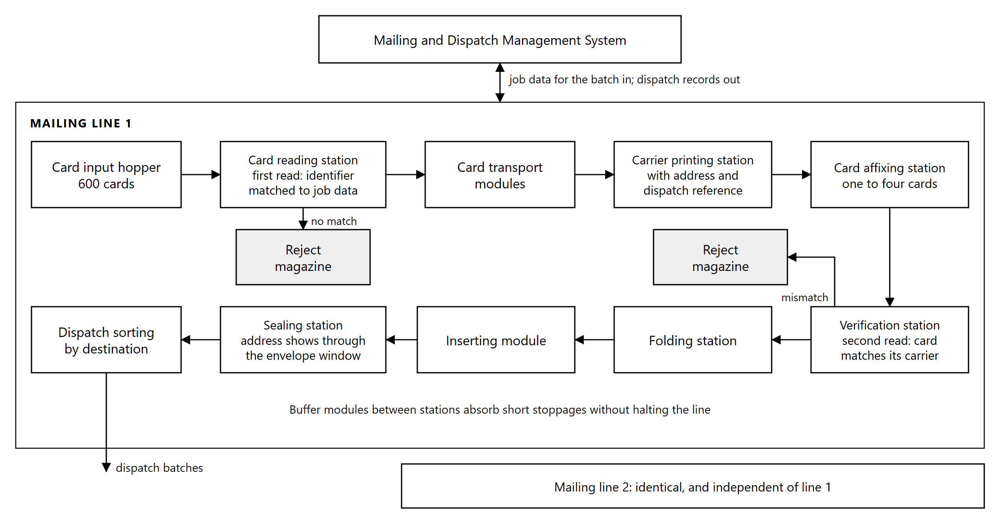

# 5. Mailing and Dispatch System

## 5.1 Configuration

Two automated mailing and dispatch systems are supplied, installed and commissioned. Each system
performs the complete sequence from card reading to sealed, addressed mail piece in a single
integrated line: card reading, card transport, carrier letter printing, card affixing, verification,
folding, envelope insertion, sealing and sorting.

Each line comprises:

| Component | Function |
|---|---|
| Card input hopper | Holds personalized cards for continuous production |
| Card reading station | Reads the machine-readable identifier engraved on each card |
| Fully integrated card transport modules | Move cards from hopper to affixing station under positional control |
| Carrier printing station | Prints the personalized carrier letter, including the destination address and the dispatch reference |
| Card affixing station | Attaches one to four cards to the carrier |
| Verification station | Reads the card and its carrier together after affixing and confirms that they match |
| Folding station | Folds the carrier to suit the envelope |
| Inserting module | Conveys the folded document into the envelope |
| Sealing station | Seals the envelope. The address and dispatch reference printed on the carrier show through the envelope window |
| Buffer modules | Absorb short interruptions without stopping the line |
| Reject magazines | Separate reject hoppers receive the cards and the carriers diverted out of the production path |
| Dispatch sorting | Groups completed mail pieces by destination for dispatch |

Personalized cards are transferred to the mailing line in batches. Each card is identified at the
reading station from the machine-readable identifier engraved on it, which the line matches against
the job data supplied for the batch. The line therefore establishes what each card is from the card
itself rather than from the order in which cards were loaded.

*Figure 5.1: Mailing line. Each card is read against the job data before its carrier is printed, and
read again with its carrier after affixing, before the mail piece is folded and inserted.*

## 5.2 Carrier letter printing and card affixing

The carrier letter is printed at the line, personalized to the recipient, immediately before the card
is attached. Printing and affixing in the same pass is what allows the carrier to be matched to the
card by data rather than by sequence.

**One to four cards per carrier.** The system attaches between one and four cards to a single carrier
letter.

The carrier accommodates A4 and US letter formats at paper weights up to 100 gsm, folded in C, V or Z
configurations according to the envelope in use.

## 5.3 Envelope insertion, sealing and address printing

After the card is affixed and the match verified, the machine conveys the document automatically through the inserting
module into the envelope. No manual handling occurs between affixing and insertion.

The envelope is then sealed. The destination address and the dispatch reference are printed on the
carrier letter and show through the envelope window, together with the courier tracking number where
a courier service is used. The destination is held on the production record retrieved from NRIS, so
the address on the mail piece derives from the same source record as the data personalized onto the
card it contains.

## 5.4 Verification and card-to-recipient matching

Verification reads 1D, 2D and QR codes.

**Matching is by identifier, not by content.** Each card carries a machine-readable identifier
derived from its card serial number. The line reads that identifier and matches it against the job
data supplied for the batch, which pairs each identifier with the carrier content and the destination
prepared for it. Matching therefore requires no access to the contents of the digitally signed QR
code, and does not depend on the order in which cards were loaded.

Every card is read twice, and each reading is checked against the record the mail piece was built
from: once at the reading station, before its carrier is printed, and again with its carrier after
affixing. The second reading is the control that matters: it confirms that the card physically
attached to the carrier is the card the carrier and the address were prepared for. Nothing separates
the card from its carrier after that point.

This detects the failure modes that arise inside the machine after correct data has been supplied.
A mis-feed, a double-feed or a card out of sequence produces a mail piece whose contents do not match
its address, and no upstream system can see that, because upstream the pairing was correct. Reading
the card and its carrier together after affixing is the point at which such a fault is caught.

Cards and carriers failing verification are diverted to the reject magazine rather than inserted.

## 5.5 Sorting, reject magazines and buffer modules

**Buffer modules** hold work in progress between stations so that a brief stoppage at one station does
not halt those upstream and downstream of it. This is what allows the line to run continuously under
sustained load rather than stopping and restarting with each minor interruption.

**Reject magazines** receive the cards and carriers diverted out of the production path. Rejected items
are held under control and recorded against the job, so that every card issued to the mailing line is
accounted for as either a completed mail piece or a recorded reject.

**Sorting** is by sequence. The Mailing and Dispatch Management System orders each batch by
destination, so completed mail pieces leave the line grouped by destination for dispatch.

## 5.6 Throughput and capacity

| Measure | Performance |
|---|---|
| Combined output, two machines | Not less than 2,000 completed mailers per hour, measured on single-card mailers |
| Output per machine | Not less than 1,000 completed mailers per hour |
| Operating window | Two shifts of seven hours, fourteen hours per day |
| Daily output | 28,000 envelopes |
| Card input hopper | 600 cards per line, for continuous production |

Two shifts of seven hours give a fourteen hour operating window, in which the two lines together
produce the 28,000 envelopes per day required.

The mailing capacity is matched to the personalization capacity described in Section 3, both lines
being rated at the same hourly figure and running in the same window. Cards therefore do not
accumulate ahead of the mailing line while personalization is running, and the buffer modules absorb
the short interruptions that would otherwise create a backlog under peak load.

## 5.7 Job data and dispatch records

The mailing system receives job data over a live interface from the Mailing and Dispatch Management
System described in Section 6.9. This interface is the direct linkage between the mailing line and
the identity data held upstream. Carrier content, destination data and the pairing of each card
identifier to its recipient are supplied to the line as data. No information is re-keyed at the
machine.

A dispatch record is generated for every mail piece, identifying the card, the cardholder, the
destination, the dispatch batch and the tracking reference where one applies. These records are the
source from which dispatch and delivery status is reported back to NRIS, and they are available for
export.

Once mail pieces are sorted and packed they are grouped by destination and released for dispatch.
The status reported to NRIS is what allows the cardholder to be notified that the card is available
for collection, drawn from the record this system produced rather than from a separate count.
