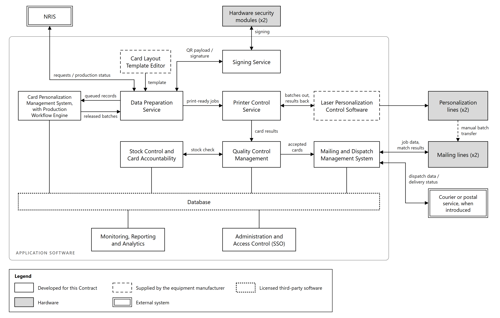
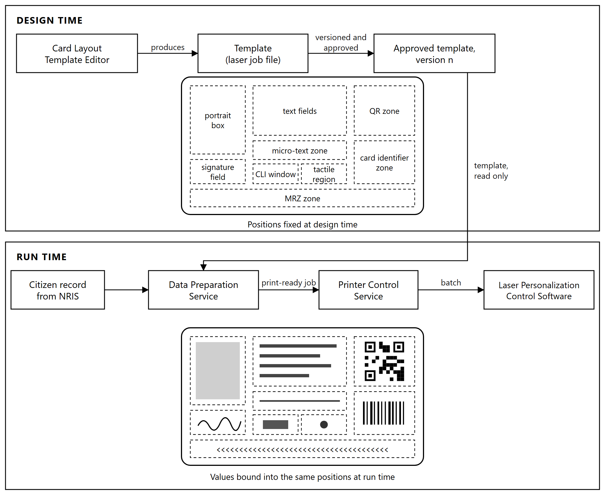

# 6. Application Software

## 6.1 Software architecture

The application software is built as a set of discrete services, each with a single responsibility and
a defined interface, rather than as a single monolithic application. Services communicate through
published interfaces and share state through the database, so that a service can be scaled, restarted
or replaced without affecting the others.

**Architectural principles**

| Principle | Effect |
|---|---|
| Single responsibility | Each service performs one function, so a fault is contained within the function where it occurs |
| Defined interfaces | Services are replaceable. The interface to the equipment manufacturer's software is one contract among several, not an embedded dependency |
| Separation of design time from run time | Card layout is defined once, under approval. The production path binds data into it and cannot alter it |
| Stateless services where possible | Production state lives in the database, so a service restart does not lose work in progress |
| Clustering and failover | Services run on a clustered platform with automated failover, backed by high-availability database clustering, replication to the secondary environment and point-in-time recovery, as described in Section 9.3. Printing jobs are balanced across the production lines, as described in Section 6.2 |

*Figure 6.1: Application component architecture. Border style shows ownership; shaded boxes are
hardware.*

**How the services relate.** The Data Preparation Service polls NRIS for citizen records released for
production and adds to the print queue those not already held in the database, so that a repeated scan
cannot queue the same request twice. The Card Personalization Management System validates the queued
records, assembles them into batches and releases the batches for production. The Data Preparation
Service binds each record into the approved card template and calls the Signing Service to sign the QR
payload, producing a print-ready job. An operator selects work from the queue and assigns it to a
production line. The Printer Control Service submits the job to the equipment manufacturer's
personalization control software and receives success and failure results back, writing them to the
database where they surface in the operator interface.
Quality Control Management evaluates verification results and reports production outcomes. Completed
cards pass to the Mailing and Dispatch Management System. Throughout, the Card Personalization
Management System, through its Production Workflow Engine, holds the state of every job and drives its progression across both production
lines and both mailing lines, and Stock Control accounts for every blank card issued. Production
status is published back to NRIS through the same interface that retrieved the records.

**Presentation.** Users reach these services through the consoles, portals and dashboards described
in Section 6.13.

## 6.2 Card Personalization Management System

The Card Personalization Management System decides what is produced. It is the system of record for a
card from the moment a record enters the print queue until the card is dispatched.

| Function | Description |
|---|---|
| Card issuance workflow management | Validates each queued record for completeness and data quality, and holds records that fail with a reason recorded against them and reported to NRIS |
| Batch processing | Groups validated records into production batches of a configurable size, 500 to 1,000 cards in normal operation |
| Job scheduling | Releases batches to production in the required order, with priority applied according to rules configured by NRB |
| Print queue management | Tracks the position of every record in the print queue, from receipt to production |
| Card lifecycle management | Maintains the state of each card across first issuance, replacement, duplicate, re-issuance, renewal and cancellation |
| Reprint and reissue handling | Manages reproduction of rejected cards within the originating job, and reissue requests arising after dispatch |

**Production Workflow Engine.** The system holds the state of every job and every card within it, and
drives progression through the production sequence:

| Function | Description |
|---|---|
| Workflow orchestration | Sequences the handoffs between services so that a job progresses from preparation through personalization and verification to dispatch without manual coordination at each step |
| Exception handling | Applies defined handling to conditions such as an unreachable interface, a failed submission or an incomplete record, holding the affected work rather than failing the batch |
| Queue prioritization | Determines the order in which queued work is consumed when capacity is constrained |
| Parallel processing | Runs work concurrently across both production lines and both mailing lines |
| Production balancing | Distributes batches across the available machines, and directs queued batches away from a machine that becomes unavailable |

**Operator-directed assignment with automated balancing.** An operator selects work and nominates the
production line through the Printer Controller Admin console. Within a line, the machine's own control
software routes cards to the available laser stations, as described in Section 3.4, so a station taken
out of service mid-batch does not stop production. Where an operator does
not nominate a line, work is allocated on available capacity.

Production status written by the Printer Control Service surfaces in this system's interface, so a
supervisor sees the live state of every batch and every card within it from one place.

## 6.3 Card Layout Template Editor

The card layout is defined once, at design time, using the graphical template editor supplied with the
equipment manufacturer's personalization software. The editor
produces a template in the job file format used by the laser marking subsystem, which fixes the
position of every element on the card.

| Element type | Configured in the template |
|---|---|
| Text fields | Position, font, size and orientation for each variable field |
| Images | Portrait box and signature field, with their dimensions and placement |
| CLI window | The region marked at two deflection angles through the lenticular structure |
| Micro-text zones | Position and content of micro-lettering, including within the portrait box |
| QR zone | Position and dimensions of the QR symbol |
| Card identifier zone | Position and format of the machine-readable rendering of the card serial number |
| MRZ zone | Position and format of the machine-readable zone |
| Tactile regions | Areas receiving raised relief marking |

The editor works in marking geometry: vectors, raster areas, text and generated symbols placed at
coordinates. Security features are expressed in the same terms. Micro-text is text at a very small
size; the changing laser image is a marking strategy applied to a defined region rather than a
distinct object type; the QR and MRZ are generated symbols placed in their zones.

**The template is a controlled artifact.** It is versioned, and a change to it passes through
approval before production uses it. Each card record carries the version of the template that produced
the card, so any card can be traced to the layout in force when it was made.

The production path cannot alter the template. Services downstream bind values into elements the
template already defines, and have no means of moving, resizing or removing them. A fault or
compromise in the production path therefore cannot relocate the portrait, shrink the micro-text or
move the QR code outside its zone.

*Figure 6.2: Design time and run time. The template fixes the position of every element; the
production path binds values into those positions and cannot alter them.*

## 6.4 Data Preparation Service

The Data Preparation Service turns an approved citizen record into a print-ready job.

**Ingestion.** The service holds the interface to NRIS. It polls for citizen records released for
production, with the demographic data of each, and checks every record against the database before
adding it to the print queue. A request already held is not queued a second time, so a repeated scan
cannot put the same request into production twice. The photograph, signature and biometric data are
retrieved for the records of a batch when the batch is prepared, as described in Section 7.8.

**Preparation.** For each record the service binds the retrieved values into the elements defined by
the approved template: name, date of birth, National Identity Number and other variable fields, the
portrait, the signature image, and the data encoded into the QR symbol, assembled and, where the
Purchaser's QR specification requires it, encrypted, in the format that specification defines. It
calls the Signing Service
to sign the QR payload, and incorporates the returned signature into the job.

**Output.** The result is a batch of cards in the format the personalization equipment expects, each
card complete with its data and its signature, ready for submission with no further processing.

**Queue services.** The same service exposes the prepared queue to the Printer Controller Admin
console, so that an operator can list work awaiting production, select what to print, and assign it
to a production line.

**Status publication.** The interface to NRIS carries production status in the return direction. The
other services write outcomes to the database as work progresses, and this service publishes them to
NRIS at each defined point. NRIS is therefore updated across a single interface rather than by several
components independently, which is what allows the status held there to be reconciled against the
production record as one set.

## 6.5 Signing Service

The Signing Service applies the digital signature carried in the QR code on every card.

It receives a prepared QR payload from the Data Preparation Service, submits it to the hardware
security modules for signing, and returns the signature. The signing key is generated inside the
module and cannot be extracted from it, so the service holds no key material of its own.

Isolating signing in a single service has three consequences:

**One enforcement point.** No card can be produced without a signature, because the only path to a
print-ready job passes through this service.

**One audited interface.** Every signing operation is logged with the record it applied to and the
certificate that signed it, so the complete set of cards signed under any certificate can be
established.

**Contained key access.** Only this service holds credentials to the hardware security modules. No
other component can request a signature, and a compromise elsewhere in the production path does not
yield the ability to sign.

Key custody, the certificate lifecycle and the signing architecture are described in Section 10.4.

## 6.6 Printer Control Service

The Printer Control Service is the boundary between the Information System and the personalization
equipment. It works in both directions.

**Outbound.** It submits prepared batches to the equipment manufacturer's personalization control
software through its application programming interface, addressed to the production line the operator
selected.

**Inbound.** It receives the result of each card from that software, success or failure, and writes
the outcome to the database against the card record. This is the path by which production status
reaches the Card Personalization Management System interface, and from the database it is published
to NRIS.

**Printer Controller Admin console.** The operator console for this service lists the prepared queue
retrieved from the Data Preparation Service, allows an operator to select work for production, and
assigns it to a nominated production line. The console also presents the live state of each line and
the progress of work in production on it.

Because the interface to the personalization equipment's software is confined to this one service,
the rest of the application software is independent of that equipment. A change of personalization
equipment affects this service and nothing above it.

## 6.7 Laser Personalization Control Software

Personalization control software supplied by the equipment manufacturer forms part of the Information
System. It receives prepared batches through its interface and performs all marking control:

| Function | Description |
|---|---|
| Laser engraving control | Drives the laser stations and sequences marking across both faces of the card |
| Greyscale personalization control | Modulates energy density to render the continuous-tone portrait |
| CLI generation | Marks the changing laser image at its two deflection angles through the lenticular structure |
| QR generation | Renders the QR symbol from the signed payload supplied in the job |
| Microtext generation | Marks micro-lettering at the positions the template defines |
| Tactile laser printing control | Controls the passes producing raised relief |
| Calibration management | Adjusts laser stations individually or together to hold marking quality consistent across the line |

The division of work is that the Information System supplies data and the manufacturer's software
marks the card. The Data Preparation Service produces the signed QR payload; this software renders it
into a symbol and engraves it. The same applies to text, portrait and micro-text: content and
position come from the prepared job, and marking is performed here.

Results for each card, success or failure, are returned to the Printer Control Service.

## 6.8 Quality Control Management

Quality Control Management evaluates the verification performed on the production line and decides
the outcome for each card.

**Data verification.** The QR code read from the card is compared, byte for byte, with the payload
prepared and signed for that card, and the engraved text, read by optical character recognition, is
compared with the source record. A card fails if either comparison fails. Neither check requires the
QR contents to be decrypted. In addition, quality assurance staff visually compare a sample of cards
from each batch with the source record.

**Stock check.** Each card is checked against the blank card stock issued to the job. A card that
cannot be matched with the controlled stock is rejected. This prevents a blank that never passed
through Stock Control from entering production, and makes card accountability a condition of
acceptance rather than a reconciliation performed afterwards.

**Engraving quality verification.** Print and engraving quality and the legibility of machine-readable
elements are assessed against the acceptance thresholds.

**Outcome management.** Accepted cards are released for mailing. Rejected cards are recorded against
the job with a reason, routed for reproduction within the same job, and held for secure destruction.
Production outcomes are reported to NRIS.

**Trending.** Rejection reasons are recorded and analyzed so that a rising reject rate is attributable
to a cause, whether a laser station drifting out of calibration, a card stock batch, or a data
condition arising upstream.

## 6.9 Mailing and Dispatch Management System

The Mailing and Dispatch Management System covers everything between a verified card and confirmed
delivery.

**Batch handover.** Verified cards are transferred by hand from the personalization output to a
mailing line. The mailing line identifies each card by reading its machine-readable code, so the
system establishes what is in the batch from the cards themselves rather than from the order in which
they were loaded.

| Function | Description |
|---|---|
| Card-to-envelope matching | Supplies the mailing line with each card identifier paired to the carrier content and destination prepared for that cardholder, and records the match confirmed at the line |
| Carrier letter generation | Produces the personalized carrier content for printing at the line |
| Envelope insertion workflows | Sequences the folding, insertion and sealing operations |
| Mailing label creation | Produces the label for each dispatch batch, carrying its dispatch reference, destination office and contents list |
| Dispatch data generation | Generates the dispatch reference and dispatch data for each mail piece and each batch, and passes them to the tracking interface |
| Courier integration | Exchanges dispatch data, tracking references and delivery status with the tracking service of a courier or postal operator, as described in Section 8.6 |
| Dispatch tracking | Maintains the status of each mail piece from packaging through dispatch to delivery |
| Reject handling workflows | Records mail pieces diverted at the line, removes them from the dispatch batch and queues them for rework |

Status reaches NRIS at each defined point: card packaged, card dispatched and card delivered.
Delivery status is written against the card record and reported to NRIS, which is what allows the
cardholder to be notified from the production record rather than from a separate count, and what
closes the loop between a record released for production and the citizen who received the card.

## 6.10 Stock Control and Card Accountability

Stock Control accounts for every blank card the Facility receives, from delivery to either a
personalized card or a certified destruction.

**Blank cards are serialized.** Every blank carries a unique serial number applied by the card
manufacturer, under a numbering scheme, format and range proposed by the Supplier and approved by the
Purchaser during design. Stock is held against that serial number rather than against a batch
quantity.
Traceability is therefore per card across the whole lifecycle, from the supplier delivery that
brought the blank into the Facility to the issued card or the destruction record that closed it out.
A count-based inventory can show that the numbers balance; only a serialized one can say which
particular blank is unaccounted for.

| Function | Description |
|---|---|
| Receipt | Books blank card deliveries into secure storage against the delivery batch, the manufacturer's identifiers and the serial number of every blank received |
| Issue | Records blanks issued from secure storage to a production job and to a named operator |
| Reconciliation | Balances blanks issued against cards personalized, cards rejected and cards remaining, for every job and every shift |
| Destruction | Records rejected and defective cards through secure destruction, with the destruction certificate closing them out of the reconciliation |
| Consumables tracking | Monitors carrier stock, envelopes and other consumables against usage |
| Low-stock alerting | Raises alerts against defined thresholds in time to reorder before production is affected |
| Inventory reporting | Produces real-time stock positions and historical consumption |
| Blank lifecycle reporting | Publishes the lifecycle state of each serialized blank to NRIS through the single NRIS interface, so that the register holds the same card-level position as the Facility, as described in Section 7.14 |

The reconciliation is the control that matters. Every blank issued to a job resolves to one of three
states: a good card produced, a rejected card destroyed under record, or a blank returned to store.
An unexplained difference is visible at the end of the shift that produced it, not at an annual audit.

Quality Control Management checks each card against this record during verification, so a card
that cannot be traced to issued stock is rejected before it reaches mailing.

**Secure destruction of rejected and defective cards.** A rejected card carries a citizen's portrait,
signature and personal data, and it carries the card body security features. It is a partial identity
document, and until it is destroyed it is an asset an attacker would want. Rejected and defective
cards are therefore held in the secure store, not in the production area, and are destroyed in
controlled batches rather than individually at the line.

| Step | Control |
|---|---|
| Quarantine | Rejected cards are booked back into secure storage against their serial number and held apart from usable stock |
| Dual custody | Destruction is performed by two authorized people together and witnessed, so that no individual can remove a card from the batch between quarantine and destruction |
| Destruction | Cross-cut shredding to a particle size at which no personal data element and no security feature can be reconstructed, to the media destruction standard recorded in the approved Standard Operating Procedure |
| Certificate | Each destruction batch produces a certificate listing every serial number destroyed, signed by both custodians |
| Reconciliation | The certificate closes those serial numbers out of the stock reconciliation, so a destroyed card cannot remain open in the ledger |

The destruction takes place in the secure destruction area provided under the facility works. What
makes the control meaningful is the closure of the loop: a blank is issued, and it resolves to a
personalized card, a serial number on a signed destruction certificate, or a blank returned to store.
There is no other outcome, and an unresolved serial number is visible at the end of the shift.

## 6.11 Monitoring, Reporting and Analytics

| Function | Description |
|---|---|
| Centralized monitoring dashboards | Present the state of the whole facility on one view |
| Real-time production monitoring | Cards produced against target, batch progress, throughput by line, reject rate against threshold |
| Machine health monitoring | Station status, error counts, consumable levels and service intervals for each machine |
| Environmental and consumable thresholds | Temperature, humidity and stock levels against defined limits |
| Alerting and notification | Raises alerts on system failure, performance degradation and consumable thresholds, delivered to operators in real time on the dashboards and consoles, and by email and SMS to the NRB staff designated for each type of alert, through the System's own mail relay and a bulk SMS service |
| Performance analytics | Throughput trends, capacity utilization, bottleneck identification and forecasting |
| SLA monitoring and reporting | Uptime, throughput and rejection rate measured against the agreed service levels |
| Predictive maintenance analytics | Identifies components trending toward failure from error rates and cycle counts, so that maintenance is scheduled before a station fails |

Reporting covers daily, weekly and monthly production volumes, card issuance statistics, rejection
rates by cause, personalization throughput, mailing performance and SLA compliance. Reports are
available to authorized users on demand and are reconcilable against the system logs they derive
from.

## 6.12 Administration and Access Control

**Single sign-on.** Users authenticate once through the single sign-on service, which issues the
credentials used by both the web interfaces and the service interfaces. Authentication is not
implemented separately by each application, so an account disabled centrally is disabled everywhere
at once.

| Function | Description |
|---|---|
| Centralized user management | Provisioning, modification and deactivation of accounts from one console |
| Role-based access control | Permissions granted by role, covering operators, supervisors, system administrators, security administrators, quality assurance staff, auditors and management |
| Multi-factor authentication | Required for administrators, operators and all privileged users |
| Privileged access management | Elevated access granted for defined purposes and periods rather than held permanently |
| Session management | Session timeout, concurrent session limits, login attempt restrictions and account lockout |
| Password policy | Minimum length, reuse prevention and screening against known compromised passwords, in line with NIST Special Publication 800-63B, for every user, administrator and break-glass account |
| Separation of duties | Roles constructed so that no single user can both perform and approve a controlled action |
| Time-bound access | Access granted for a defined period and withdrawn automatically on expiry |
| User activity logging | Every interaction recorded against the user who performed it |
| Audit trails | Time-stamped, tamper-proof records of system access, data access, administrative actions and security events, searchable and exportable |

Audit records cannot be altered by any user, including administrators. The record of who released a
batch, who ran it, who calibrated a station during it and when each occurred is available for the
retention period and is exportable for external audit.

## 6.13 Presentation Layer

Users work with the Information System through graphical interfaces, each built around the work of
one role. The consoles, portals and dashboards are web applications, served by the application
services and used from the workstations listed in Section 9.1, so a change to an interface is
deployed once on the server rather than on each workstation. Two interfaces run locally: the Card
Layout Template Editor, installed on the design workstation in the controlled design area, and the
machine software, which provides the operator interface on the control computer of each line.

| Interface | Used by | Presents |
|---|---|---|
| Printer Controller Admin console | Operators and supervisors | The prepared queue, the selection of work and its assignment to a line, and the live state of each line, as described in Section 6.6 |
| Supervisor dashboard | Supervisors | The Card Personalization Management System's view of every batch and every card within it, records held at validation with their reasons, exceptions awaiting a decision, and the shift reconciliation, as described in Section 6.2 |
| Quality control console | Quality assurance staff | Rejected cards with their reasons, their reproduction within the job, and reject trends, as described in Section 6.8 |
| Mailing and dispatch console | Operators | The handover from personalization, card-to-envelope matching, diverted mail pieces and dispatch batches, as described in Section 6.9 |
| Stock control console | Operators assigned to stock control | Receipt, issue, return and destruction of serialized blanks, and the reconciliation by job and shift, as described in Section 6.10 |
| Production monitoring dashboard | Supervisors, system administrators and management | The whole facility on one view: lines, stations, throughput, environment and consumables, as described in Section 6.11 |
| Reporting and analytics dashboards | Supervisors, quality assurance staff and management | Production, issuance, rejection, mailing and service level reporting, and performance analytics, as described in Section 6.11 |
| Audit interface | Auditors and security administrators | Audit trails, searchable and exportable, as described in Section 6.12 |
| Administration portal | System administrators and security administrators | User and role management, configuration and reference data, as described in Section 6.12 and Section 12.1 |
| Card Layout Template Editor | Template designers and approvers | Card templates, their versions and their approval, as described in Section 6.3 |
| Machine operator interface | Operators at the line | Station status, faults, calibration and the status of each record in the job, as described in Section 3.9 |

**Role-based views.** An interface shows only the functions and data the user's role grants. An
operator's console carries no administration functions, and the audit interface reads the record
without being able to change it. Where a controlled action can be taken is set by the workstation as
well as by the role: the context-aware access control described in Section 10.3 ties such actions to
the workstations provided for them, so work is released to a line only from the production
supervision workstations and a template is changed only from the design workstation, whoever is
signed in.

**Secure authentication.** The web interfaces authenticate through the single sign-on service
described in Section 6.12, with multi-factor authentication for operators, administrators and all
privileged users, and are served over TLS 1.2 or higher only. A session left unattended locks at the
timeout set for its role and is resumed only by signing in again.

**Multilingual support.** Interface text is held in language resource files, separate from the
application code, and the interface language is selected per user. The interfaces are delivered in
English, and a further language is added by supplying its resource file, with no change to the
application. Data is held and displayed in Unicode throughout, so a name appears on screen and in
reports exactly as NRIS holds it, whatever characters it contains.

**Real-time operational visibility.** Status changes are pushed to every interface displaying them
as they are recorded, rather than collected when a page is refreshed, so the dashboard a supervisor
is watching changes when the line does. Standard queries respond within 2 seconds, as set out in
Section 11.2.

**Operator workflow interfaces.** Each console is laid out as the sequence of the task it supports,
and at each step offers only the actions valid in the current state of the work. A batch cannot start
production before blanks are issued to it, and cannot be closed until every blank issued to it is
accounted for.

| Workflow | Console | Sequence |
|---|---|---|
| Batch production | Printer Controller Admin console | Select prepared work, confirm the blanks issued to it, assign a line, follow progress, close the batch |
| Reject review | Quality control console | Review each rejected card and its reason, follow its reproduction within the job, hand it over for quarantine |
| Mailing | Mailing and dispatch console | Record the handover from personalization, follow matching at the line, resolve diverted mail pieces, close the dispatch batch |
| Stock movement | Stock control console | Book receipts, issue blanks to a job and an operator, book returned blanks and rejected cards back into store, record destruction |
| Template change | Card Layout Template Editor | Edit the template, submit it for approval, release the approved version to production |

**A step that needs a second person is completed at the same console.** Where separation of duties
requires approval, as for releasing a template or recording a destruction batch, the second person
authenticates at the console where the step is taken, and the approval is recorded against that
person rather than against the session already open.

**Error handling and notification interfaces.** A condition is shown to the person who can act on it,
in the interface that person is using, with what is needed to act on it:

| Condition | Shown in | Detail given |
|---|---|---|
| Card rejected at the line | Machine operator interface and quality control console | The card, the reason and the reproduction status, as described in Section 3.7 |
| Station or machine fault | Machine operator interface, Printer Controller Admin console and production monitoring dashboard | The station, the error code and its interpretation, as described in Section 12.2 |
| Record held at validation | Supervisor dashboard | The record and the reason, as reported to NRIS |
| Failed exchange with NRIS | Supervisor dashboard and administration portal | The work held and its retry state, as described in Section 7.12 |
| Mail piece diverted at the line | Mailing and dispatch console | The mail piece, the reason and its rework status |
| Unreconciled blank | Stock control console and supervisor dashboard | The job, the shift and the serial numbers not accounted for |
| Threshold breach | Production monitoring dashboard, with email and SMS | The measure, its threshold and its trend, as described in Section 6.11 |

Every notification carries its severity, its time and the object it concerns. Acknowledgment is
recorded against the user who gave it, and a notification not acknowledged within the time set for
its severity escalates under the rules described in Section 12.2.

## 6.14 Software inventory and licensing

Every software title forming part of the Information System is inventoried and classified as system,
general purpose or application software; as standard or custom software; and as proprietary or open
source. License terms are supplied for each title.

The inventory covers software developed for this Contract, standard software supplied under license,
the personalization and mailing control software supplied by the equipment manufacturer, including the
card layout template editor, database and operating system software, and the monitoring and security components.

Licensing is provided for three years from Operational Acceptance, covering the license entitlement
itself together with support and updating subscription for the same period. Entitlements are mapped to
the functional components they serve, so that the licensing position for any part of the system can
be established directly. The itemized licenses, with their metrics, quantities and that mapping, form
the Licensing Bill of Materials submitted with the Preliminary Project Plan.

Where any component is open source software, it is identified as such and the applicable licenses
are supplied.
