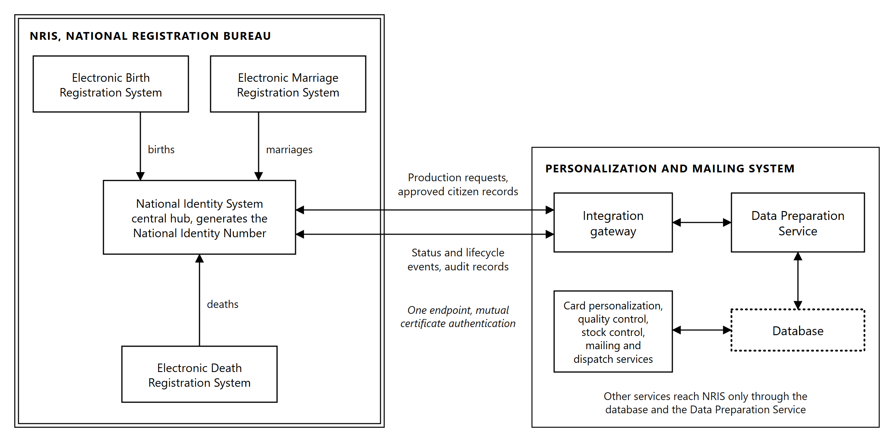

# 7. NRIS Integration

## 7.1 Integration architecture

The Personalization and Mailing System integrates with NRIS across a single controlled boundary. All
data crossing that boundary passes through one interface, and no component of the production system
holds a connection to NRIS of its own.

**The counterpart system.** NRB operates four registration systems: the Electronic Birth Registration
System, the National Identity System, the Electronic Marriage Registration System and the Electronic
Death Registration System. The National Identity System is the central repository and integration hub
connecting the civil registration systems, and it generates and manages the National Identity Number
carried across all of them.

Integration is therefore directed at the hub rather than at the registration systems individually. A
civil event registered in its own system reaches the hub, and the hub releases the card production
request that reaches the personalization system. Card production consumes one consolidated identity
record rather than reconciling four sources, and the National Identity Number is the key that ties
every produced card back to the citizen record it came from.

*Figure 7.1: Integration with NRIS. Civil registration events reach the National Identity System hub,
and production exchanges with the hub through a single endpoint. The double border is the
Purchaser's estate.*

**What crosses the boundary.**

| Function supported | What is exchanged |
|---|---|
| Automated card production requests | Requests released by NRIS and retrieved by the production system |
| Secure transfer of citizen demographic and biometric data | Approved citizen records, biographical data, photograph, signature image and biometric data |
| Card personalization and issuance | Personalization data generated from the retrieved record, and issuance confirmation returned |
| Quality assurance and production monitoring | Verification outcomes, reject reasons and production quality data returned |
| Mail processing and dispatch | Address data drawn from the citizen record, and packaging and dispatch events returned |
| Status tracking and reporting | Production, dispatch and delivery status at each defined point |
| Reprint and replacement card management | Reprint and replacement requests inbound, and their outcomes returned |
| Audit and traceability | Transaction records establishing traceability from the NRIS record through to dispatch |

**A single integration gateway.** The production system presents one endpoint to NRIS. The interface
is held by the Data Preparation Service described in Section 6.4. Other services reach NRIS through
the shared database and that service rather than by connections of their own.

This has three consequences:

**One surface to secure.** Encryption, certificate handling, authentication and key management are
configured and audited at one point rather than in every service that has something to exchange with
NRIS. The attack surface presented to the Purchaser's network is one interface, not several.

**One record of what was exchanged.** Every transaction crossing the boundary is logged at the same
point. Traceability from the NRIS record through personalization and mailing to dispatch is read from
a single sequence rather than assembled by correlating logs from several components after the fact.

**One interface to test and to change.** Interface testing, system integration testing and user
acceptance testing address a single contract. A change on the NRIS side is absorbed within one
service rather than in every component that holds a connection.

**Integration patterns.** The interface supports REST APIs, SOAP web services, secure file transfer,
message queues and middleware integration, and database integration services. Which of these carries
each exchange is settled against the interfaces NRIS exposes, and is described in Section 7.2.

## 7.2 Interfaces, protocols and middleware

The interfaces between NRIS and the Personalization and Mailing System are specified and designed as
part of the supply, and the production side of each is developed, tested and deployed with it. NRB
developers build the NRIS side of each interface, working to the same Interface Control Documents and
in coordination with the Supplier. The integration supports the following transports:

| Transport | Use |
|---|---|
| REST APIs | Request and response exchanges where a reply is needed within the call |
| SOAP web services | Exchanges where NRIS exposes a SOAP contract |
| Secure file transfer | Scheduled bulk exchanges and historical synchronization |
| Message queues and middleware | Asynchronous exchanges where the two systems must not be coupled to each other's availability |
| Database integration services | Direct database exchanges where the Purchaser approves them, described in Section 7.5 |

**Message formats.** Payloads are carried as JSON or XML, and file exchanges as a defined delimited
or fixed-width flat file. The format for each exchange is fixed in its Interface Control Document
together with the schema that validates it, so that a message is rejected at the boundary when it
does not conform rather than being part-processed inside the production system.

**How the transport for each exchange is settled.** The choice is made against the interfaces NRIS
already exposes, not imposed on it. Where NRIS presents a working interface, that interface is
consumed as it stands. Where none exists for a required exchange, one is specified, agreed with the
Purchaser and documented before development begins.

The governing principle is that the production system adapts to NRIS. Card production is the new
system in this relationship, and a national identity register in live operation is not a safe place
to absorb change driven by a downstream consumer.

**The present position.** NRIS integrates with the existing card printers through a middleware
application connected directly to the database. For the new system, the Purchaser develops and
provides the NRIS application programming interface, and the integration is designed to it, with the
database connectivity described in Section 7.5 available where the Purchaser approves it.

**Interface Control Documents.** Every interface is documented in an Interface Control Document
before it is built, covering the transport, the operation, the request and response structures, the
field-level data definition, the error conditions and the expected behavior on each. The Interface
Control Documents are a named deliverable, listed in Section 7.17, and they are the reference against
which interface testing is performed.

**Middleware and orchestration.** Middleware components are configured where an exchange requires
routing, translation or decoupling rather than a direct call:

| Function | Effect |
|---|---|
| Service orchestration workflows | Sequences multi-step exchanges so that a single business event resolves the calls it requires, in order |
| Message routing | Directs each message to its destination by content and type rather than by fixed endpoint |
| Exception handling | Applies defined handling to a failed exchange rather than discarding it, holding the affected work and raising it for attention |
| Retry mechanisms | Repeats a failed exchange on a defined schedule, with a limit, so that a brief interruption on either side does not require manual recovery |

Retry with a limit is what distinguishes a recoverable interruption from a fault. An exchange that
succeeds on retry is recorded and continues. One that exhausts its retries is raised as an exception
under Section 7.12 rather than retried indefinitely, so that a persistent fault becomes visible
instead of consuming capacity silently.

## 7.3 Data mapping and transformation

**Analysis before mapping.** NRIS data structures are analyzed before any mapping is written. The
analysis establishes, for each field the personalization system requires, where it is held in NRIS,
its type and length, its permitted values, whether it is mandatory, and how it behaves when absent.
Mapping written without that analysis produces a system that works on the sample data it was built
against and fails on the population.

**Field mapping.** Each NRIS field is mapped to its counterpart in the personalization system, and
the mapping is recorded field by field in the Data Mapping and Transformation Document listed in
Section 7.17. The data elements carried are:

| Group | Elements |
|---|---|
| Demographic data | National ID Number, names, date of birth, gender, nationality, address information, district, Traditional Authority, card serial number, which the production system returns to NRIS |
| Biometric data | Facial image, fingerprint references, signature image |
| Card data | Card issue date, card expiry date, card type, card status |

**Transformation rules.** Where the representation in NRIS differs from what personalization
requires, a transformation rule is defined and applied in one place. Date formats, name ordering
and casing, character handling in names, image format and resolution
conversion for the portrait and signature, and address composition into the lines printed on the
carrier are each governed by a stated rule rather than by handling written into individual
services.

**Validation and cleansing.** Every record is validated before it is queued for production.
Validation covers presence of mandatory fields, conformance to the defined types and lengths, and
consistency between related fields. Records that fail are held with the reason recorded and reported
to NRIS, and are not released to production.

Validating at the boundary rather than at the machine is what keeps a data fault cheap. A record
rejected before it enters the queue costs nothing. The same record discovered at the personalization
line has already consumed a blank card from controlled stock.

## 7.4 Secure data exchange

Citizen demographic and biometric data crosses the boundary on every production run, so the exchange
is secured at transport, message and identity level rather than at any one of them alone.

| Control | Implementation |
|---|---|
| TLS-secured communications | All exchanges run over TLS. Plain-text transport is not offered or accepted on any interface |
| End-to-end encryption | Payloads carrying biometric or personal data are encrypted end to end between the NRIS interface and the integration gateway, with no intermediate point at which they are decrypted. Where the NRIS interface supports message-level encryption, payloads are also encrypted for the receiving system |
| Digital certificates | Both systems present certificates. The production system authenticates NRIS and is authenticated by it |
| PKI-based authentication | Machine identity is established by certificate rather than by a shared secret held in configuration |
| Data integrity validation | Each exchange carries an integrity check, so alteration in transit is detected rather than assumed absent |
| Secure key management | Private keys used for interface authentication are held in protected storage with controlled access and a defined rotation schedule |

**Mutual authentication is the control that matters here.** One-sided authentication proves to the
production system that it is talking to NRIS, and proves nothing to NRIS about what is asking it for
citizens' biometric records. Both directions are authenticated by certificate.

The key material used for interface authentication is separate from the signing key used for the
biometric QR code on the card. They serve different purposes, are held separately and are managed
under different lifecycles. The card signing architecture is described in Section 10.4.

## 7.5 Database connectivity

Database connectivity to NRIS is provided where the Purchaser approves it. Interface-based exchange
is preferred over direct database access, because an interface is a stable contract while a database
schema is an internal detail of NRIS that may change without notice to the systems reading it.

| Provision | Description |
|---|---|
| Secure connectivity | Connections to NRIS databases run over encrypted channels, from defined hosts, under named service accounts |
| Read-only interfaces | Retrieval of citizen and card data uses read-only access, so that no production process can alter an NRIS record by that route |
| Transactional interfaces | Where the Purchaser approves write access for a defined purpose, exchanges are transactional, so that a partial update cannot be left committed |
| Data synchronization | Reference data held on both sides is synchronized on a defined schedule, with differences reported rather than silently reconciled |
| Performance optimization | Queries are written and indexed against the access patterns card production generates, and reviewed with the Purchaser before deployment |

Read-only by default is deliberate. Card production consumes identity data and produces card data. It
has no reason to modify a citizen record, and an architecture that cannot do so is easier to assure
than one that merely does not.

## 7.6 Real-time and batch processing

The integration carries both real-time and batch exchanges, matched to what each carries rather than
applied uniformly.

| Mode | Exchanges |
|---|---|
| Real time | Card production requests, card status updates, production alerts |
| Batch | Daily card production batches, bulk reprints, historical data synchronization |

**Why the split falls where it does.** A status update is worth nothing late. Its purpose is to let
NRIS answer where a citizen's card has reached, and a delayed answer is a wrong answer. A production
alert is worth nothing late for the same reason. Daily production batches and historical
synchronization move volume rather than answer questions, and are scheduled so that the volume runs
when it does not compete with production traffic.

Both modes write to the same records and the same audit trail, so a card that entered production in a
batch and reported status in real time has one history, not two.

## 7.7 Card production request management

The system receives card production requests from NRIS and processes each automatically:

| Step | Action |
|---|---|
| Validate records | Each request is validated against the rules described in Section 7.3. Failures are held with a reason and reported to NRIS |
| Queue records for production | Validated records are placed in the print queue, checked against the queue and the production database before being added |
| Assign production batches | Queued records are assembled into production batches of a configurable size, 500 to 1,000 cards in normal operation |
| Generate production jobs | Each batch is prepared into a print-ready job and released to a production line |

**How requests reach the system.** The production system retrieves requests released by NRIS rather
than waiting to be called. Each retrieved request is checked against the database before it is
queued, and a request already held is not queued a second time.

This matters for a national program. A retrieval that repeats after an interruption, a restart or a
network fault cannot place the same request into production twice, because the check is on the
request rather than on the delivery. A system that depends on each request arriving exactly once has
no defense when it arrives twice, and a second card produced from the same request is an error in the
register rather than merely a wasted blank.

Retrieval also means production continues to accept work without requiring NRIS to hold a connection
to the Card Production Facility, and resumes on its own after an interruption rather than requiring
the queue to be replayed by hand.

## 7.8 Citizen data retrieval

For each record released for production, the personalization system retrieves from NRIS:

| Element | Use |
|---|---|
| Approved citizen records | The record authorizing production. Approval is determined in NRIS before release |
| Biographical information | Variable data engraved on the card, and the data used to compose the carrier letter and the address printed on it |
| Photograph | The greyscale portrait and the secondary image engraved into the card body. The source image is checked against the ICAO specifications for size and resolution when it is retrieved, and a record whose image does not conform is held with its reason and reported to NRIS |
| Signature image | The signature field engraved on the card |
| Card issuance information | Card type, issue date, expiry date and card status, which determine the layout applied and the lifecycle state recorded |

Retrieval runs over the secured exchange described in Section 7.4. Biographical information is
retrieved with each request, and the photograph, signature and biometric data for the records in the
batch being prepared. All of it is held only for as long as production requires it, so the Card
Production Facility does not accumulate a second copy of the national register.

## 7.9 Personalization and quality assurance integration

**Personalization.** From the retrieved record the system generates the personalization data, applies
the approved card layout, and produces the print-ready job that drives marking:

| Function | Where it is performed |
|---|---|
| Generate card personalization data | Data Preparation Service, binding retrieved values into the approved template |
| Produce card layouts | The approved template fixes every element position, as described in Section 6.3 |
| Print visual information | Laser marking of variable text, portrait and signature within the card body |
| Laser engrave card information | Laser engraving of all personalization elements within the card body |
| Encode machine-readable data | The digitally signed biometric QR code described in Section 4.5 |

The cards supplied are chipless, so chip encoding does not arise. The machine-readable elements
carried on the card include the QR code, verified in line, and the card identifier, which the mailing
line reads to match each card to its mail piece.

**Quality assurance.** Verification results are integrated with NRIS so that the production outcome
for every card is recorded against its citizen record:

| Function | Description |
|---|---|
| Verify printed information | Engraved data, read by optical character recognition, is checked against the source record for every card |
| Verify laser engraving | Engraving quality is assessed against the acceptance thresholds |
| Verify machine-readable elements | The QR code read from the card is compared, byte for byte, with the payload prepared and signed for that card, and the card identifier is read and matched to the record |
| Reject defective cards | Cards failing any check are diverted from the production path and recorded against the job with a reason |
| Update NRIS on production outcomes | Each outcome, accepted or rejected, is reported with its reason |

Reporting rejections with their reasons, rather than reporting only successes, is what allows NRIS to
distinguish a card that is late from a card that will not arrive. A citizen whose card was rejected
and is being reproduced has a different answer waiting at the registration office than a citizen
whose card is already in the post.

## 7.10 Card lifecycle transactions

The integration manages the full card lifecycle against NRIS. Each transaction type is distinguished
by the type carried on the NRIS record and produces a defined outcome:

| Transaction | Outcome |
|---|---|
| New card issuance | A card is produced against a newly issued National Identity Number |
| Replacement card | A card is produced against the existing National Identity Number, and the superseded card is flagged in NRIS |
| Duplicate card | A further card is produced against the existing record, the two distinguished by card serial number |
| Lost card | The lost card is flagged in NRIS and a replacement is produced |
| Damaged card | The damaged card is flagged in NRIS and a replacement is produced |
| Card cancellation | No card is produced. The record is flagged in NRIS and any card already in production is withdrawn from the job |

Re-issuance on a change of personal details and renewal on expiry, described in Section 2.3, follow
the same path against the existing National Identity Number.

Every card carries a card serial number unique to the physical card, distinct from the National
Identity Number it bears. This is what makes the lifecycle tractable. A citizen who has held four
cards has one National Identity Number and four serial numbers, and the status of each card is
recorded independently. Without it, a replacement cannot be distinguished from the card it replaced.

**Cancellation while a card is in production.** A cancellation arriving after a job has been released
withdraws that card from the job. The blank is accounted for under Section 6.10 as a card withdrawn
rather than produced, so cancellation does not open a gap in the reconciliation.

## 7.11 Production status feedback

The personalization system updates NRIS automatically at each defined point. No status event depends
on an operator remembering to report it:

| Event | Raised when |
|---|---|
| Job received | A production request has been retrieved from NRIS |
| Card in production | The record has been assigned to a batch and released to a production line |
| Card personalized | Marking of the card is complete |
| Quality control completed | In-line verification has been evaluated and the outcome decided |
| Card rejected | The record failed validation and was not released to production, or the card failed verification and has been diverted for reproduction and secure destruction |
| Card packaged | The card has been affixed to its carrier and verified, and the mail piece inserted and sealed |
| Card dispatched | The mail piece has been released for dispatch to its destination |
| Card delivered | Arrival at the destination has been confirmed and the card is available for collection |

Events are written as they occur and published over the interface described in Section 7.1. Each
carries the National Identity Number, the card serial number, the job and the time of the event, so a
status update is attributable to a specific physical card rather than to a batch.

Mailing and dispatch integration, and the dispatch and delivery tracking that produces the last two
events, are described in Section 8.

## 7.12 Reprint and exception management

**Reprint.** A reprint request arriving from NRIS is treated as a production request carrying a
reprint type. It is validated, queued and produced on the same path as any other card, and raises the
same status events. Cards reproduced after rejection inside a job are handled within that job under
Section 3.7 and do not return to NRIS as new requests, because the original request has not yet been
satisfied.

The distinction matters for reconciliation. A card reproduced inside its job resolves the original
request. A reprint requested after dispatch is a new request against the same citizen record, and
produces a card with a new serial number.

**Exception management.** An exception is any condition that prevents an exchange or a card from
completing as expected. Each is handled by a defined path rather than by discarding the work:

| Condition | Handling |
|---|---|
| Interface unreachable | The exchange is retried on schedule under Section 7.2. Work in progress is held rather than failed |
| Retries exhausted | The exchange is raised as an exception for attention, with the affected records identified |
| Record fails validation | The record is held with its reason and reported to NRIS. It is not released to production |
| Record incomplete on retrieval | The record is held pending retrieval of the missing elements rather than produced with gaps |
| Card withdrawn after release | The card is removed from the job and accounted for in the stock reconciliation |
| Duplicate request detected | The request is not queued a second time, and the condition is recorded |

Every exception is recorded against the record it affects, and is visible in the operator interface
and in the reporting described in Section 7.13. An exception handled silently becomes a defect in the
register, discovered by the citizen at a service counter rather than by the Facility that caused it.

## 7.13 Reporting and analytics integration

Production data is made available to NRIS reporting for:

| Report | Content |
|---|---|
| Daily production volumes | Cards produced per day, per line and per shift |
| Card issuance statistics | Volumes by transaction type across first issuance, replacement, duplicate and cancellation |
| Rejection rates | Rejections as a proportion of production, with reasons, by line and by station |
| Personalization throughput | Achieved rate against the contractual rate in Section 3.5, per machine and combined |
| Mailing performance | Mail pieces completed, rejects at the mailing line, and dispatch volumes |
| SLA compliance | Performance against the agreed service levels |

Reporting draws on the same production records that drive status feedback, so a figure reported to
NRIS reconciles to the card-level data behind it. Reporting built on a separate extract diverges from
the operational record in a way that is not visible until the two are compared.

Rejection rates are reported with their reasons rather than as a single figure. A rate is a symptom.
The reason distinguishes a laser station drifting out of calibration from a card stock batch or a
data condition arising upstream, and only the reason indicates what to do about it.

## 7.14 Audit trail and end-to-end traceability

All transactions are traceable from NRIS through card production and mailing.

| Log | Content |
|---|---|
| Transaction logging | Every exchange crossing the boundary, with its direction, payload reference, outcome and time |
| Security logging | Authentication events, certificate validation outcomes, and access grants and denials on the interface |
| User activity tracking | Operator and administrator actions, identifying who performed each action and when |
| Audit trail synchronization | Production audit records aligned with the NRIS audit trail so that the two reconcile |
| Blank card stock | The lifecycle state of every serialized blank, published from the Stock Control function described in Section 6.10 |

**Blank card traceability reaches NRIS.** Blank cards are serialized by the manufacturer, and the
interface carries each blank's state to NRIS from supplier delivery through issue to a production
job, to either the personalized card it became or the record of its destruction. The register
therefore holds the same card-level stock position as the Facility, and a blank that is unaccounted
for is visible to the Purchaser rather than only in a local reconciliation.

**The traceability chain.** Every record is keyed to the National Identity Number and the card serial
number, and every stage writes against that key. A single card is therefore traceable from the
request retrieved from NRIS, through validation, preparation, signing, marking, verification,
packaging and dispatch, to delivery confirmation, without correlating records across systems by
inference.

Synchronization between the two audit trails is what makes the chain complete rather than merely
local. A production audit trail that cannot be aligned with the NRIS trail establishes what happened
inside the Card Production Facility and nothing about what was asked of it.

Time is synchronized across all components against a common source, so that events ordered by their
recorded time are ordered as they occurred.

## 7.15 Disaster recovery integration

Integration is designed to continue across a failover on either side.

| Provision | Description |
|---|---|
| Integration with NRIS disaster recovery mechanisms | Interfaces are configured against the NRIS recovery endpoints as well as the primary, so a failover on the NRIS side does not require reconfiguration at the Card Production Facility |
| Failover support | Interface components run on the clustered infrastructure described in Section 9.3, so the loss of a node does not interrupt exchange |
| Continuity of card production | Work already retrieved and held in the production database continues to be produced while the NRIS interface is unavailable |

**Why production continues through an interface outage.** Records retrieved and queued are held in
the production database with everything required to produce them. A loss of the NRIS interface stops
new work entering and stops status leaving. It does not stop the cards already prepared from being
produced, verified, packaged and dispatched.

Status events raised while the interface is unavailable are held and published when it returns, in
the order they occurred. Nothing is discarded because it could not be sent at the moment it arose,
and the traceability chain in Section 7.14 closes without gaps once the interface recovers.

## 7.16 Integration testing

Integration is tested at five levels before Operational Acceptance. Each level is performed against
the Interface Control Documents described in Section 7.2, and produces a report listed in
Section 7.17.

**Interface testing.**

| Test | Coverage |
|---|---|
| API testing | Every operation on every interface, against its documented request and response structure |
| Data validation testing | Field-level conformance to type, length and permitted values, including boundary values and absent optional fields |
| Error handling testing | Each documented error condition, confirming the system produces the defined behavior rather than an undefined one |

**System integration testing.** End-to-end data flow from the retrieval of a request through to
delivery confirmation, process orchestration across the full production sequence, and exception
handling exercised by inducing the conditions listed in Section 7.12 rather than by inspection.

**Performance testing.** Throughput against the required production rate, batch processing capacity
at the daily volume, and concurrent transaction processing at the expected load. Performance is
verified at the volumes the system is contracted to sustain, not at a reduced scale.

**Security testing.**

| Test | Coverage |
|---|---|
| Vulnerability assessment | The integration components and the hosts they run on |
| Penetration testing | The exposed interface surface, performed against the deployed configuration |
| Authentication testing | Certificate validation, rejection of invalid and expired certificates, and refusal of unauthenticated requests |
| Encryption validation | Confirmation that data in transit is encrypted as specified, and that weak protocol versions and cipher suites are refused |

**User acceptance testing.** NRIS stakeholders are supported in validating business workflows,
functional requirements and reporting requirements against the live integration. Support covers test
data preparation, scenario walkthroughs, defect triage and retesting.

Exception handling and error conditions are tested by inducing them. A path that has never failed
under test is an untested path, and interface faults in production arise from the conditions that
were never exercised.

## 7.17 Integration deliverables

We will provide the following integration deliverables:

| # | Deliverable |
|---|---|
| 1 | Integration Strategy and Methodology |
| 2 | Detailed Integration Architecture |
| 3 | Interface Control Documents |
| 4 | API Specifications |
| 5 | Data Mapping and Transformation Documents |
| 6 | Security Design Documentation |
| 7 | Test Plans and Test Scripts |
| 8 | Integration Test Reports |
| 9 | Performance Test Reports |
| 10 | Security Test Reports |
| 11 | As-Built Integration Documentation |
| 12 | Operations and Maintenance Manuals |
| 13 | Knowledge Transfer and Training Materials |

Deliverables are issued in editable format and as PDF. As-Built Integration Documentation reflects
the integration as deployed at handover rather than as designed, and is reissued if the integration
changes during the warranty period.
