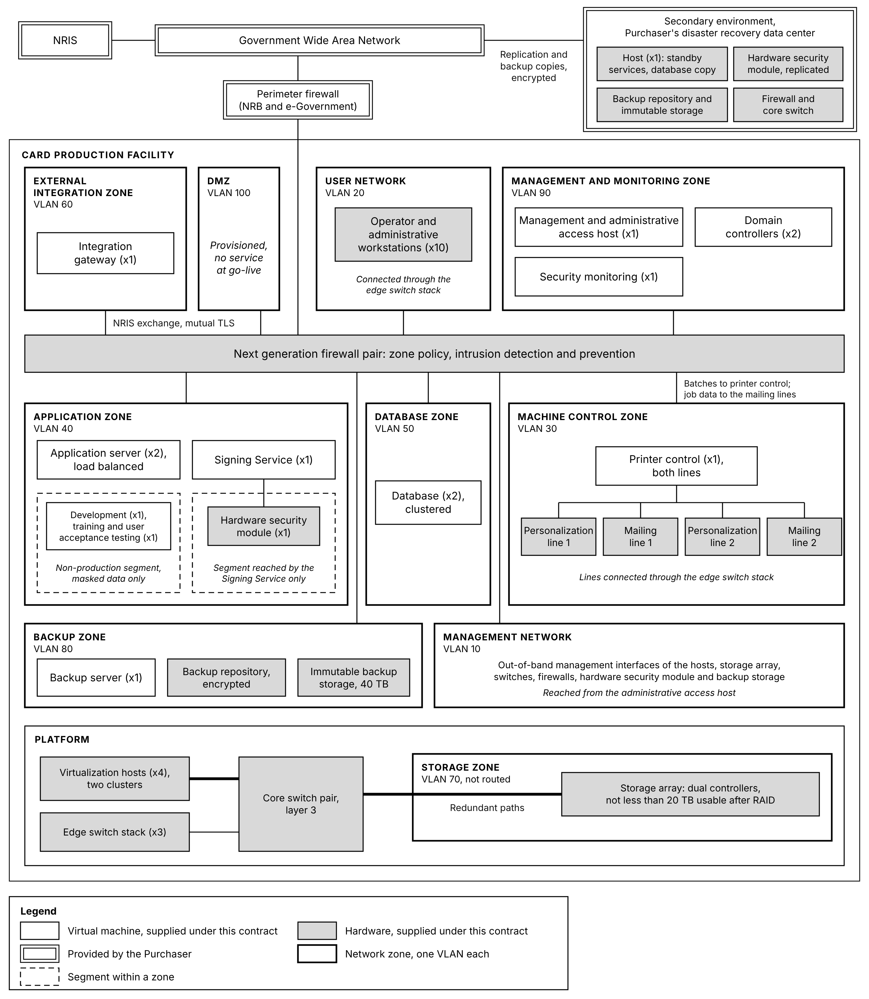
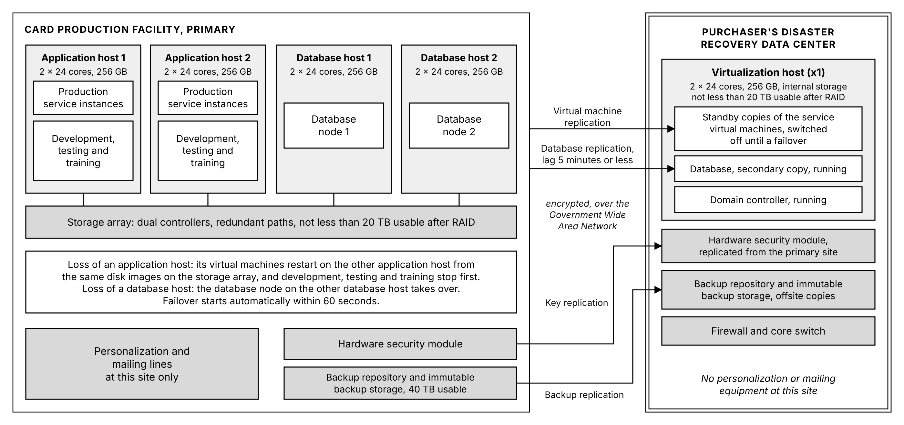

# 9. Infrastructure

## 9.1 Deployment architecture and platform

The infrastructure supporting the Information System is supplied, installed and configured as part
of the scope. It is sized for a national identity production facility rather than for the average
load, because the consequence of undersizing is a queue of citizens rather than a slow report.

**Sizing basis.** Quantities below are derived from the performance requirements the System is
contracted to meet, rather than chosen and then justified:

| Driver | Requirement | Consequence |
|---|---|---|
| Record scale | 10 to 50 million identity records | Storage capacity for production data |
| Retention and growth | 10 to 15 years, 15 percent annual growth | Capacity expansion without platform replacement |
| Audit and log volume | Millions of entries per day, retained 5 to 10 years | Storage, typically exceeding the production data |
| Availability | Not less than 99 percent | The workload must survive the loss of a host |
| Failover | Automatic within 60 seconds | Clustered hosts rather than a manual rebuild |
| Concurrent users | Up to 100 without degradation | Application server capacity, load balanced across two application servers |
| Production rate | 2,000 cards per hour, with portrait and signature handling | Processing and network capacity between services and lines |

**Storage derivation.** The portrait, signature and biometric data are held only while a card is in
production, as described in Section 7.8, so what is retained for each card is its production and
dispatch record: identifiers, card serial number, status history and dispatch details. Allowing 5
kilobytes per card including index overhead, the upper record scale of 50 million gives approximately
0.25 terabytes, and the data of cards in production at any time adds little to that. Audit and log
data at several million entries per day, retained for ten years and compressed as required, gives
approximately 4 terabytes. Machine telemetry, reporting and working space add approximately 1
terabyte, for approximately 5 terabytes derived.

The platform provides **not less than 20 terabytes usable after RAID at Operational Acceptance**, more than three
times the derived figure, so that several years of the 15 percent annual growth are absorbed within the
initial provision. Raw capacity is provisioned above that, because part of it holds the parity that
protects the data on the storage array against drive failure. Growth beyond the initial provision is
met by adding drives or drive enclosures to the array rather than by replacing the platform, which
is how the 15 percent annual growth is absorbed across a ten to fifteen year retention period.

**Storage array.** The virtual machines and their data are held on a dual-controller enterprise
storage array shared by the four virtualization hosts of the primary site. The platform is Windows
Server with Hyper-V, and the hosts form two failover clusters over the shared storage, an application
cluster and a database cluster of two hosts each. The array has two controllers
with non-disruptive failover between them, redundant power, and solid-state drives in a protected
pool, RAID 6 or the manufacturer's equivalent, which keeps the data available through the failure of
any two drives. Data on the array is encrypted at rest. Snapshots on the array are operational aids,
such as a rollback point before a change, and are not backups. Backups are written to the separate
immutable backup storage, under the regime described in Section 12.3.

The failure of a controller, a power supply, a path to a host or a drive leaves the data and every
service available. Because the hosts hold no production data of their own, a host can also be lost
or taken out for patching without reducing the protection of the data. The array is nonetheless one
chassis, and its total loss would stop every service at the primary site. That case is covered by
the secondary environment described in Section 9.3, which carries the data and the application
services until the array is restored.

**Host derivation.** The primary site runs **four virtualization hosts** in two clusters, each host
with two processors of 24 cores and 256 GB of memory. The application cluster of two hosts carries
the integration, application, machine control, management, directory, security and backup virtual
machines and the non-production environments, and each of its hosts is sized to run every
production virtual machine of the cluster on its own. The database cluster of two hosts carries the
two database nodes, one on each host, so that the database has processor, memory and storage paths of
its own and never contends with the application workload. When a host in either cluster is lost, or
taken out for patching, the other host of that cluster carries its workload at full performance, and
the non-production environments are the first workloads stopped to make room for it.

**Primary site deployment.**

| Element | Quantity | Role |
|---|---|---|
| Application hosts | 2 | Two processors of 24 cores and 256 GB of memory each. Application cluster with automated failover over the storage array, carrying the integration, application, machine control, management, directory, security and backup virtual machines and the non-production environments, each sized to run every production virtual machine of the cluster alone |
| Database hosts | 2 | Two processors of 24 cores and 256 GB of memory each. Database cluster over the storage array, one database node on each host |
| Storage array | 1 | Holds the virtual machines and their data, not less than 20 TB usable after RAID, with dual controllers, redundant power and solid-state drives in a protected pool |
| Backup repository | 1 | Encrypted, managed by Veeam Backup & Replication, holding the restore points used for routine restoration |
| Immutable backup storage | 1 | Not less than 40 TB usable, encrypted, covering retention cycles, with copies that no administrator can alter or delete before their retention ends |
| Core switches | 2 | Layer 3, redundant pair carrying the zone VLANs, including the Storage Zone |
| Edge switches | 3 | Managed and non-PoE, in one stack, connecting the operator and administrative workstations in the User Network, the personalization and mailing lines in the Machine Control Zone, and the management interfaces in the Management Network, to the core pair |
| Next generation firewalls | 2 | High availability pair, providing zone policy and intrusion detection and prevention |
| Hardware security module | 1 | Holds the Document Signer key, replicated to a second module at the secondary site, as described in Section 10.4 |
| Operator and administrative workstations | 10 | Client devices for the consoles described below |

**The storage network is specified, not assumed.** Every read and write of every virtual machine
passes between the hosts and the storage array, so the storage network carries the production
workload rather than only management traffic. Each host reaches both controllers over two
independent paths, one through each core switch, with multipath across them, so that the loss of a
path, a switch or a controller leaves every host with a route to the data. The paths, and the core
switch ports that carry them, are provisioned accordingly. Under-specifying them is the common way
such a deployment performs poorly while appearing correctly built.

**Platform integrity.** Secure boot is enabled on the virtualization hosts, on every virtual
machine, on the backup repositories and the immutable backup storage, and on the operator and
administrative workstations, so
that firmware, boot loader and operating system kernel are verified against trusted signatures
before the platform loads, and the network, storage and security devices load only firmware images
signed by their manufacturer. The hardened configuration
baselines applied on top of it are described in Section 12.1. The control matters here because an
attacker who can place code below the operating system is beneath every control the operating system
provides, including the audit trail that would otherwise record the intrusion.

**Workstations.** The equipment manufacturer supplies the industrial control personal computers that
form part of each personalization and mailing line. The workstations below are the client devices for
the software described in Section 6:

| Purpose | Quantity |
|---|---|
| Production supervision, Printer Controller Admin console | 2 |
| Quality control review | 2 |
| Mailing and dispatch operation | 2 |
| Stock control and secure storage | 1 |
| Card layout design, in the controlled design area | 1 |
| System administration | 2 |

**Virtual machine inventory.** The services described in Section 6 are deployed as follows, each
within the network zone appropriate to its function:

| Virtual machine | Services | Zone | Instances |
|---|---|---|---|
| Integration gateway | The NRIS interface of the Data Preparation Service, described in Section 7.1 | External Integration Zone | 1 |
| Application server | Card Personalization Management, Data Preparation, Quality Control Management, Stock Control and Card Accountability, Mailing and Dispatch Management System, and Monitoring, Reporting and Analytics | Application Zone | 2 |
| Signing Service | Signing Service, the sole client of the hardware security modules | Application Zone | 1 |
| Database | Clustered database, two nodes, one on each database host | Database Zone | 2 |
| Printer control | Printer Control Service and the interface to the manufacturer's personalization control software, for both personalization lines | Machine Control Zone | 1 |
| Management | Administration and Access Control, administrative access host, and the mail relay that sends alert emails | Management and Monitoring Zone | 1 |
| Directory | Domain controllers: the directory, authentication and name resolution for the estate, and its common time source. The two run on different application hosts and replicate to each other, and a third runs at the secondary site | Management and Monitoring Zone | 2 |
| Security monitoring | Security information and event management, log aggregation, endpoint management | Management and Monitoring Zone | 1 |
| Backup server | Veeam Backup & Replication: backup scheduling, cataloging, replication to the secondary site and restoration | Backup Zone | 1 |

**Both application servers are active.** Application and administrative traffic is load balanced
across the two application server instances, which the cluster keeps on different application hosts.
Each instance is sized to carry the whole load, so that when one is lost the other takes its traffic
at once, while the cluster restarts the lost instance on the surviving host.

**The database runs on hosts of its own.** The two database nodes run on the two hosts of the
database cluster, one on each, so that the database never contends with the application workload for
processor, memory or storage paths, and no single host failure affects both nodes.

**The DMZ is provisioned and carries no service at go-live.** The zone is configured with its policy
and addressing in place, so that any externally exposed service the Purchaser later introduces has a
prepared place to go. The System as offered exposes no service outside the production network.

**The Signing Service is deployed alone.** It is the only component holding credentials to the
hardware security modules, and Section 10.1 rests on that being true. It runs in a virtual machine of
its own, because sharing an operating system with other services would leave the claim depending on
operating system separation alone.

**Printer control serves both lines.** One instance addresses both personalization lines. The lines
remain independent of each other, because each runs the manufacturer's control software on its own
industrial control PC. If its host is lost, the instance is restarted on the other application host.

**Time synchronization.** The domain controllers provide the common time source for the estate,
themselves synchronized to external reference time sources through the firewalls, so that time
does not depend on any NRB service. Section 10.6 depends on events ordered
by their recorded time being ordered as they occurred, and that holds only where every component
takes its time from one place.

**Secondary site.** The secondary environment is deployed into the Purchaser's existing disaster
recovery data center, on equipment supplied under this Contract. It uses none of the Purchaser's data
center equipment: the Purchaser provides the space, power, cooling and the Government Wide Area
Network connection.

| Element | Quantity | Role |
|---|---|---|
| Virtualization host | 1 | Standalone, with the same processors and memory as the primary hosts, and internal storage of not less than 20 TB usable after RAID. It runs 7 virtual machines: the secondary copy of the database, kept current by database replication; a domain controller, kept current by directory replication; and standby copies, one of each, of the integration gateway, application server, management, security monitoring and backup server virtual machines, kept current by virtual machine replication |
| Backup repository | 1 | Encrypted, receiving the backup copies replicated from the primary site |
| Immutable backup storage | 1 | The offsite copy of the backups, not less than 40 TB usable, encrypted |
| Next generation firewall | 1 | Standalone, providing zone policy and intrusion prevention for the secondary environment |
| Core switch | 1 | Layer 3, standalone, carrying the secondary environment's network. No separate edge switches are needed at this site |
| Hardware security module | 1 | Replicated from the module at the primary site, as described in Section 10.4 |

The secondary site carries no personalization or mailing equipment and no machine control instances,
because there is no equipment there to control. A single host is sufficient because high availability
is required of the production system rather than of its standby: the standby is needed when the
primary storage or the primary site is lost, and its own loss does not affect production. For the
same reason its virtual machines are held on the host's internal storage rather than on a storage
array. A shared array earns its place by letting clustered hosts reach the same disks, and a single
standby host has no other host to share them with.

**Non-production environments.** Three environments are provided in addition to production:

| Environment | Purpose |
|---|---|
| Development | Configuration and interface development |
| Training | Operator and administrator training, isolated from production |
| User acceptance testing | Purchaser validation of workflows, functions and reporting |

These run on two virtual machines on the hosts of the application cluster: one for development, and
one shared by training and user acceptance testing, which run the same released version. With them,
the primary site runs 14 virtual machines: the 12 production virtual machines in the inventory above
and these 2. They sit on a segment of their own within the Application Zone, which the firewall pair
separates from every production service, as described in Section 9.2. Running them on the
production platform keeps them on the same software and versions as production and under the same
physical controls, without further hardware. They are the first workloads stopped when a host is
lost, so that production keeps its full capacity.

Personal data is masked in every non-production environment, so that training and testing do not
create further copies of citizen records.

**Database platform.** The data layer uses an enterprise-grade database platform providing:

| Capability | Purpose |
|---|---|
| High-volume transactional processing | Sustains the transaction rates described in Section 11.4 under production load |
| ACID compliance | A production transaction either completes or does not, so a card cannot be half recorded |
| Clustering and high availability | The database survives the loss of a node without losing committed work |
| Replication | Maintains the secondary copy described in Section 9.3 |
| Encryption at rest | Protects identity and personalization data on disk, under Section 10.2 |
| Backup and recovery | Supports the backup and restoration regime in Section 12.3 |
| Point-in-time recovery | Allows recovery to a chosen moment rather than only to the last full backup |

The data layer holds identity data, personalization data, production logs, audit logs, machine
telemetry, and mailing and dispatch data. These are held in one platform under one backup and
retention regime, so that a card can be traced across all of them without correlating separate
stores.

Final component specifications, including the drive configuration of the storage array and of the
secondary host, the resulting raw capacity, and the capacity of the backup repositories, are
confirmed during detailed design against the approved data volumes, the backup retention policy and
the layout of the allocated room.

## 9.2 Network architecture and security zoning

The network is divided into ten segregated zones, each a separate VLAN. Traffic between zones passes
through firewall policy, and no zone is reachable from another by default.

| VLAN | Zone | Contents |
|---|---|---|
| 10 | Management Network | The management interfaces of the hosts, the storage array, the switches, the firewalls, the hardware security module and the backup storage, reached from the administrative access host |
| 20 | User Network | The operator and administrative workstations, connected through the edge switch stack |
| 30 | Machine Control Zone | The personalization and mailing lines and their control systems, connected through the edge switch stack |
| 40 | Application Zone | The application services described in Section 6, including the Signing Service, and, on segments of their own, the hardware security module and the non-production environments |
| 50 | Database Zone | The database nodes |
| 60 | External Integration Zone | The interface to NRIS and to external services |
| 70 | Storage Zone | The traffic between the virtualization hosts and the storage array, and nothing else |
| 80 | Backup Zone | The backup server, the backup repository, the immutable backup storage and the backup traffic |
| 90 | Management and Monitoring Zone | Administration, the directory, monitoring and logging, and the security services: security information and event management, endpoint management and privileged access management |
| 100 | DMZ | Reserved for a reverse proxy, application programming interfaces and other approved external-access services. No service is deployed there at go-live |

The External Integration, Application, Database and Machine Control Zones are the production zones.
The User Network holds the people who use the System. The Management Network, the Storage Zone and
the Backup Zone carry the infrastructure, the Management and Monitoring Zone is the management and
security zone, and the DMZ is reserved for externally exposed services.

Traffic between zones is routed only through the firewall pair, which applies the zone policy and
intrusion prevention, and the Storage Zone is not routed at all. Communications are encrypted in transit as
described in Section 10.2, and replication and backup copies between the primary and secondary
sites cross the Government Wide Area Network inside an encrypted tunnel between the firewalls at
each site.

*Figure 9.1: Network zones. Ten zones, each a VLAN, with every routed path between them passing
through the firewall pair. Double borders are provided by the Purchaser; shaded boxes are hardware.*

**Why the Machine Control Zone is separated.** The personalization and mailing lines run industrial
control systems with their own lifecycle, patched to the equipment manufacturer's schedule rather
than to the operating system vendor's. Placing them in their own zone means that constraint does not
set the patching posture of the rest of the estate, and that a compromise elsewhere does not reach
the equipment that produces identity documents. The lines connect to the edge switch stack on ports
assigned to the Machine Control Zone, which reach the other zones only through the firewall pair.
Personalization line 1 and mailing line 1 connect to one switch of the stack and the lines numbered
2 to another, so the loss of a switch takes one pair of lines out of production rather than all four.

**Why the Database Zone is separated from the Application Zone.** The application services are the
components that talk to other systems and therefore the components most exposed. Requiring traffic
to the database to cross a policy boundary means that reaching an application service does not by
itself yield the identity data behind it.

**The Storage Zone is carried separately.** Traffic between the virtualization hosts and the storage
array is placed in a zone of its own, which is not routed, so that storage traffic and application
traffic do not compete, and so that the storage array is not reachable from the service zones.

**Backup traffic has a zone of its own.** Backups move large volumes of data, and the copies they
make are what recovery from an attack depends on. The Backup Zone keeps that traffic off the
production zones, and the backup server reaches the systems it protects only through firewall rules
that permit backup traffic and nothing else, as described in Section 12.3.

**Workstations, administration and the signing modules.** The workstations listed in Section 9.1 sit
in the User Network, connected through the stack of three edge switches, and reach the application
services only through firewall policy. Administration of any zone passes through the administrative
access host in the Management and Monitoring Zone, so no workstation holds a direct administrative
path to a server in normal operation. The out-of-band management interfaces of the hosts, the storage
array and the network and security devices sit in the Management Network, reached from the system
administration workstations under a recorded break-glass procedure when the administrative access
host is itself unavailable. The hardware security module at the primary site sits on a segment of the
Application Zone that only the Signing Service can reach, and the module at the secondary site on the
corresponding segment there, reachable from the Signing Service only through the encrypted tunnel
between the sites. The boundary described in Section 10.1 is therefore enforced by the network as
well as by the credentials.

**Facility systems.** The physical access control, intrusion detection, environmental sensors and
uninterruptible power supplies installed under the facility works run on a network of their own,
outside the zones above. Their events and readings reach the monitoring described in Section 12.2
and security information and event management through the firewall pair, on rules that permit only
that exchange with the Management and Monitoring Zone, so that no facility device has a path into a
production zone.

**The non-production segment.** The development, training and user acceptance testing environments
sit on a segment of their own within the Application Zone, which the firewall pair separates from
every production service, and hold masked data only. A fault induced in training, or an untested change in development, cannot reach
production.

**Wide area connectivity.** Connectivity between the Card Production Facility, NRIS, the secondary
environment and the other NRB services the System exchanges with is carried on the Malawi Government
Wide Area Network, which the Purchaser provisions. The bandwidth, latency, availability and firewall
openings each link requires, and the internet access that security subscriptions and software
updates need, are specified during design from the NRIS exchange and the replication and backup
volumes, for the Purchaser to provision against. NRB's perimeter firewall and the wide area service
are administered jointly by NRB and e-Government and sit outside the scope of supply.

**Remote administration.** Remote administration follows the same path as administration on site.
A remote session arrives through the access NRB and e-Government arrange and is subject to their
controls, is encrypted to the firewall pair, is authenticated with multi-factor authentication, and
reaches only the administrative access host, from which privileged access is issued for a session
and a purpose under Section 10.3. No function of the System depends on remote access being
available.

## 9.3 High availability, failover and disaster recovery

**High availability within the facility.** Application services are clustered across the two hosts
of the application cluster, the two database nodes run on the two hosts of the database cluster,
every host reaches the storage array through both of its controllers, and printing jobs are
distributed across available
lines by the Card Personalization Management System described in Section 6.2. The failure of a
line, an edge switch, a host, a database node, a storage controller, a core switch or a firewall
reduces throughput, or pauses it for the failover window, rather than stopping production. Nor does
the failure of the hardware security module at the primary site: the Signing Service then signs
through the replicated module at the secondary site, over the encrypted connection between the
sites, until the module is replaced. The loss of the storage array as a whole is the exception, and
is covered by the secondary environment.

| Measure | Target |
|---|---|
| Failover initiation | Automatic, within 60 seconds |
| Recovery Time Objective, full service recovery | 5 to 15 minutes |
| Recovery Point Objective, maximum data loss on failover | 5 minutes |
| Data synchronization lag, primary to secondary | Near real time, and not more than 5 minutes |
| System availability | Not less than 99 percent |

The recovery targets are agreed with the Purchaser during design. Availability is measured across
the warranty and post-warranty periods. Scheduled maintenance windows, NRIS unavailability, and power
or connectivity failures external to the card personalization system are excluded from the
measurement.

**What happens when a host is lost.** When an application host is lost, the virtual machines running
on it are restarted on the other application host, from the same disk images, which it can read
because they are held on the storage array rather than on the failed host. Application traffic is
carried throughout by the application server instance on the other host. That host is sized to run
every production virtual machine of the cluster on its own, so production continues at full capacity
while the non-production environments are stopped. When a database host is lost, the database node
on the other database host takes over without losing committed work. Nothing is restored and nothing
is copied at the time of failure, which is what allows
recovery to complete within the stated window rather than within the time a restoration would take.

**Secondary environment.** The secondary environment is deployed into the Purchaser's existing
disaster recovery data center in Blantyre, on the equipment described in Section 9.1. No new
disaster recovery facility is constructed under this Contract, and the renovation scope is confined
to the primary site.

The secondary environment is functional and operational at Operational Acceptance, as a warm
standby. On the internal storage of its single host it holds a running replicated copy of the
production database, a running domain controller, and standby copies of the service virtual
machines kept current by replication and started on failover. Beside the host are the offsite
backup copies and the replicated hardware security module. Recovery therefore does not depend on
rebuilding from installation media.

| Element | Provision |
|---|---|
| Primary environment | The production estate at the Card Production Facility |
| Secondary environment | Deployed into the Purchaser's existing disaster recovery data center |
| Backup replication | Encrypted replication by Veeam Backup & Replication of the backups of databases, configuration, application systems and audit logs to the backup repository and the immutable backup storage at the secondary site |
| Offsite backup storage | Encrypted, immutable backup copies held away from the primary site |
| Synchronization | Replication of the production database within the lag stated above |

*Figure 9.2: High availability and the secondary environment. Double borders are provided by the
Purchaser; shaded boxes are hardware.*

**What the secondary environment does and does not cover.** It carries the data and the application
services, and its hardware security module holds the Document Signer key, so that production can
resume after the loss of the primary site without waiting for a new certificate. It does not carry
personalization or mailing equipment, or the machine control and signing services that drive them,
which exist only at the Card Production Facility. A loss of the primary
storage or of the primary site therefore preserves the record of every card produced and every card
in progress and keeps those records available to NRIS and to reporting, and production resumes when
the production platform, and after a site loss the equipment, is available again.

**Testing.** Disaster recovery is tested at least annually, by simulating full system failure,
verifying data integrity after recovery, and recording the recovery point and recovery time achieved
in a test report retained as audit documentation. The findings of each test are corrected in the
recovery procedures before the next. Recovery procedures are documented for manual execution as well
as automated, because the circumstances in which they are needed are the circumstances in which
automation may also have failed.

## 9.4 Infrastructure scope of supply

The supporting ICT infrastructure, its software licenses and three years of support are within the
scope of supply and appear in the System Inventory Tables.

**Scope boundary.** The items below are the ICT equipment. The facility infrastructure listed in
Section 9.5, including the power, environmental, fire and physical security infrastructure, is
delivered under the facility works.

**Hardware.**

| Item | Quantity | Specification |
|---|---|---|
| Application hosts, primary site | 2 | Enterprise rack servers, two processors of 24 cores and 256 GB of memory each, redundant power, redundant paths to both controllers of the storage array with multipath, clustered with automated failover, each sized to run every production virtual machine of the application cluster alone, and carrying the non-production environments |
| Database hosts, primary site | 2 | Enterprise rack servers, two processors of 24 cores and 256 GB of memory each, redundant power, redundant paths to both controllers of the storage array with multipath, clustered, one database node on each |
| Storage array, primary site | 1 | Enterprise storage array, dual controllers with non-disruptive failover, redundant power, solid-state drives in a protected pool, RAID 6 or the manufacturer's equivalent, encryption at rest, not less than 20 TB usable after RAID |
| Backup repository, primary site | 1 | Encrypted, managed by Veeam Backup & Replication |
| Immutable backup storage, primary site | 1 | Not less than 40 TB usable, encrypted, with retention that no administrator can override |
| Virtualization host, secondary site | 1 | Standalone enterprise rack server, two processors of 24 cores and 256 GB of memory, redundant power, internal storage of not less than 20 TB usable after RAID, running the 7 virtual machines of the secondary environment at the Purchaser's disaster recovery data center |
| Backup repository, secondary site | 1 | Encrypted, receiving the backup copies replicated from the primary site |
| Immutable backup storage, secondary site | 1 | The offsite copy of the backups, not less than 40 TB usable, encrypted |
| Core switches, primary site | 2 | Layer 3, redundant pair, carrying the zone VLANs, including the Storage Zone |
| Edge switches, primary site | 3 | Managed, non-PoE, stacked, for the User Network, the Machine Control Zone and the Management Network |
| Next generation firewalls, primary site | 2 | High availability pair, with intrusion detection and prevention |
| Next generation firewall, secondary site | 1 | Standalone, with zone policy and intrusion prevention for the secondary environment |
| Core switch, secondary site | 1 | Layer 3, standalone, carrying the secondary environment's network |
| Hardware security modules | 2 | One at each site, the module at the secondary site replicated from the module at the primary site, FIPS 140-2 or FIPS 140-3 validated |
| Operator and administrative workstations | 10 | Client devices for the consoles listed in Section 9.1 |
| Structured cabling and patching | As required by the approved room layout | Equipment room patching and connection of equipment to the network |

**Software.**

| Item | Coverage |
|---|---|
| Server operating system and hypervisor | All hosts, primary and secondary. One platform provides both, with failover clustering of the application hosts and of the database hosts |
| Virtual machine operating systems | All virtual machines |
| Windows Server client access licenses | Every person holding an account on the System |
| Workstation operating system | The operator and administrative workstations |
| Backup storage operating system | The backup repository and the immutable backup storage at each site |
| Database platform, SQL Server | The clustered database at the primary site and its secondary copy at the secondary site, with SQL Server Developer for the non-production environments |
| Backup and recovery platform, Veeam Backup & Replication | All protected systems at the primary site, with replication of the backups to the secondary site |
| Security information and event management | All sources across the estate |
| Endpoint detection and response | All servers, virtual machines and workstations |
| Privileged access management | All administrative and privileged accounts |
| Multi-factor authentication | All administrators and operators |
| Vulnerability scanning | All hosts, virtual machines, network devices and workstations |
| Next generation firewall security subscriptions | All three firewalls |
| Storage array and network device support and firmware | The storage array, all switches and all firewalls |
| Hardware security module client software and support | Both modules, and the Signing Service that reaches them |
| Monitoring and log aggregation | All infrastructure and application sources |
| SMS alert service | Subscription to a bulk SMS provider in Malawi for the delivery of alerts, for three years |
| Application software | The services described in Section 6 |

**Licensing and support.** Every license above is provided with three years of support and updates
from Operational Acceptance, as described in Section 6.14.

**General technical requirements.** All active equipment complies with:

| Requirement | Specification |
|---|---|
| Electrical supply | 220V plus or minus 20V, 50Hz plus or minus 2Hz |
| Power plugs | British Standard |
| Operating temperature | 18 to 27 degrees Celsius |
| Relative humidity | 40 to 60 percent |
| Dust | 0 to 40 grams per cubic meter |
| Noise | Not greater than 80 decibels |
| Electromagnetic emission | US FCC Class B, or EN 55022 and EN 50082-1, or equivalent |
| Language | English |

## 9.5 Facility requirements

The Information System places the following requirements on the facility that houses it, and they
are delivered under the facility works rather than as ICT equipment under Section 9.4. Apart from the
Government Wide Area Network connection and NRB's perimeter firewall described in Section 9.2, the
System is designed without reliance on any existing electrical, environmental, network or security
infrastructure at the site.

| Requirement | Provision |
|---|---|
| Power | Uninterruptible power supply sized for the production and server loads, generator support with automatic transfer, power distribution and grounding |
| Environment | Air conditioning, ventilation and humidity control holding the production area and the secure areas within the operating range in Section 9.4, precision cooling for the equipment room and the personalization room, air filtration to the dust limit in Section 9.4, and environmental monitoring of temperature, humidity and power |
| Physical security | Biometric access control to the server room and the production area, with every entry logged, including escorted visitors, closed circuit television with defined retention, and intrusion detection |
| Fire | Fire detection throughout, clean agent suppression in the equipment room, and suppression appropriate to a production area elsewhere |
| Racks | Equipment racks, rack power distribution units and console access for the ICT equipment in Section 9.4, to the approved room layout, and one rack at the secondary site |
| Secure areas | Separated areas for blank card storage, personalization equipment, data processing systems and secure destruction. The blank card store holds the full 2,000,000 cards, all of which are delivered before commissioning |

The Purchaser supplies a dedicated electrical connection to the facility, provisioned against the
final approved design, and coordinates the statutory approvals for the structural and electrical
designs.

**Environmental monitoring is linked to alerting, not only to record.** Temperature, humidity, power
and uninterruptible power supply status, reported by the sensors and the uninterruptible power supply
installed under the facility works, feed the monitoring described in Section 12.2, and thresholds
raise alerts before a condition reaches the point where production is affected. An environmental log that is only read
after an outage explains the outage rather than preventing it.

**Why the secure area separation matters to the system rather than only to the building.** Stock
control under Section 6.10 accounts for every blank card from receipt to issuance or destruction.
That accounting is only meaningful if blanks are physically held where access is controlled and
recorded, and if rejected cards are destroyed in a controlled area. The physical separation is the
condition that makes the recorded reconciliation true.
