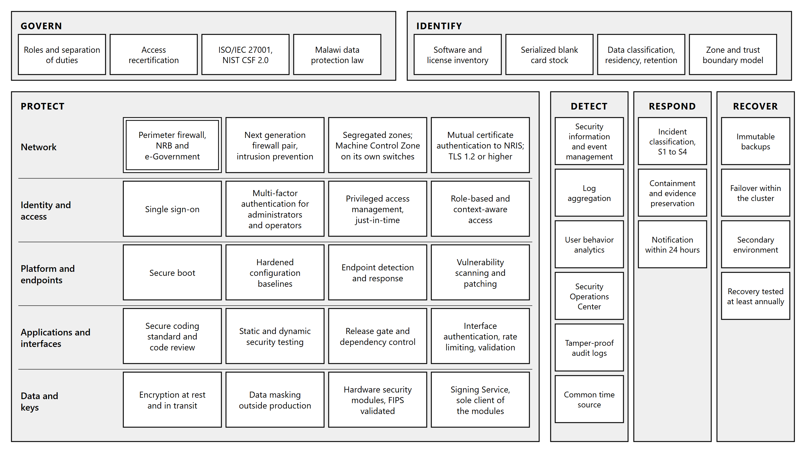
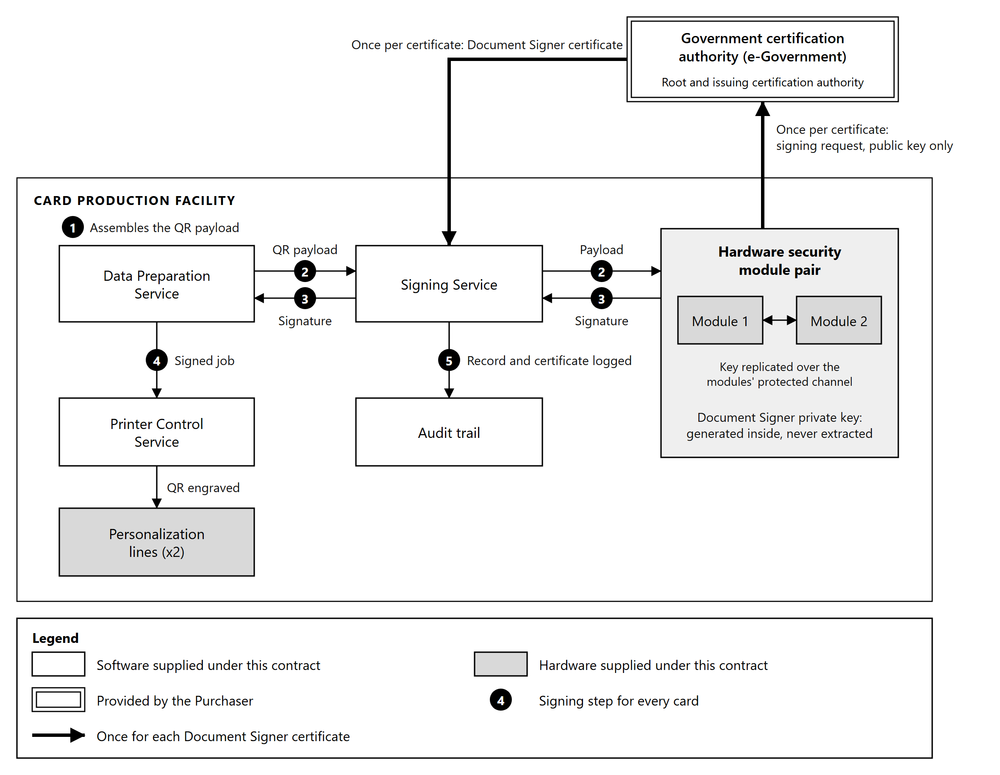

# 10. Security Architecture

## 10.1 Security model

The security architecture is layered, so that no single control is the only thing standing between an
attacker and a citizen's identity data.

**Governing principles.**

| Principle | Application |
|---|---|
| Zero trust | No component is trusted because of where it sits on the network. Every request is authenticated and authorized on its own merits |
| Least privilege | Each account and each service holds the minimum rights required for its function, and no more |
| Segmentation | Zones are isolated by firewall policy, so reaching one does not yield the next. The zones are described in Section 9.2 |
| Defense in depth | Transport, message, identity and storage are each protected independently, so the failure of one does not expose the data |
| Traceability | Every action is attributable to an identity and a time, under Section 10.6 |

**What the architecture is protecting.** Two million citizens' demographic records, photographs,
signatures and fingerprint data pass through this system, and it produces the document by which a
citizen proves who they are. The consequence of compromise is not data loss alone. It is the
production of a genuine card for a person who is not entitled to one, which is why the controls on
stock, on signing and on privileged access are treated as production controls rather than as
administrative ones.

**Trust boundaries.** Three boundaries carry the weight of the model:

| Boundary | Control |
|---|---|
| Between NRIS and the production system | Mutual certificate authentication and encrypted exchange, under Section 7.4 |
| Between the application services and the equipment | The Machine Control Zone is isolated, and two defined interfaces cross into it: batches for the personalization lines through the Printer Control Service, and job data for the mailing lines from the Mailing and Dispatch Management System |
| Between any service and the signing key | Only the Signing Service holds credentials to the hardware security modules, under Section 10.4 |

*Figure 10.1: Cybersecurity architecture. Protective controls in depth from the network to the data and
keys, with detection, response and recovery spanning every layer, arranged by the functions of the
NIST Cybersecurity Framework 2.0. The double border is provided by the Purchaser.*

## 10.2 Data protection and encryption

| Control | Implementation |
|---|---|
| Data classification | Data is classified by sensitivity into citizen biometric and personal data, production and dispatch records, audit and security logs, and configuration and reference data, and each class carries its rules for storage, transfer, export, retention and destruction |
| Encryption at rest | AES-256 for all personally identifiable information, including the production database, its secondary copy and backups |
| Encryption in transit | TLS 1.2 or higher on every interface, internal and external. Plain-text transport is not offered |
| Data masking | Personal data is masked in development, training and user acceptance testing environments |
| Secure deletion | Defined sanitization procedures for media and for records reaching the end of their retention |
| Export control | Data leaves the System only through its defined interfaces and the export functions granted to specific roles, each export logged against the user who made it. Removable storage is disabled on the servers and workstations, outbound traffic from each zone is limited by firewall policy to the destinations it requires, and retrieval volumes inconsistent with production are detected under Section 10.7 |
| Retention enforcement | Retention and archival policy applied by the platform rather than by operator action, under Section 11.4 |

**Data minimization and purpose limitation.** The production system is not a second national
register. It retains production and audit data. Demographic data is retrieved with each request,
and the photograph, signature and biometric data for the batch in preparation, and all of it is held
only while production requires it, with NRIS remaining the system of record.
Each data element is retrieved for card production and is used for no other purpose, and the
interface requests only the elements the card and the mail piece require rather than the whole
citizen record. This is both a data protection position and an architectural one: the smaller the
standing copy of citizen data, the smaller the consequence of compromise.

**Privacy by design.** The system is built to the principles of the Data Protection Act 2024 and to
the General Data Protection Regulation principles the Purchaser applies: lawful basis, purpose
limitation, minimization, accuracy, storage limitation, integrity and confidentiality, and
accountability. The system supports Privacy Impact Assessment by exposing what personal data it
holds, where each element came from, which component processes it, how long it is retained and who
has accessed it, so that an assessment can be evidenced from the system rather than reconstructed
from documentation. A Privacy Impact Assessment is performed during design and repeated when a
change alters what personal data is held or how it is processed.

**Data residency.** Citizen data is not stored or processed outside Malawi. Where any activity would
otherwise require it, including factory testing and remote support, it is performed against
synthetic or masked data. NRB is the data controller for citizen data held in the system.

## 10.3 Identity and access management

**Directory.** The System runs its own directory on two domain controllers, one in the Management
and Monitoring Zone of the primary site and one at the secondary site, each holding a full copy of
the directory kept current by directory replication, so that identity and authentication depend on
no NRB service. While the domain controller at the primary site is restarted or patched, the one at
the secondary site serves authentication and name resolution. Every operator and administrator holds one identity in it, used by every interface
through the single sign-on service described in Section 6.12, so an account disabled in the directory
is disabled everywhere at once.

| Control | Implementation |
|---|---|
| Role-based access control | Rights are granted to roles, and roles to people. No right is granted to an individual directly |
| Multi-factor authentication | Required for administrators and operators, and for all privileged access |
| Privileged access management | Privileged credentials are held under management, issued for a session and a purpose rather than held permanently |
| Just-in-time provisioning | Elevated access is granted for a defined window and withdrawn automatically |
| Session management | Session timeouts and concurrent session limits configurable per role |
| Context-aware access | Access conditioned on the device and the network location the request comes from, so that a privileged operation is refused from an unexpected origin even with valid credentials |
| Access logging | Every authentication, authorization and privileged action is logged, under Section 10.6 |
| Access recertification | Periodic review of who holds what, with rights not reconfirmed being withdrawn |

**Separation of duties.** The roles that matter are separated in the role model: the operator who
runs a production job, the supervisor who releases it, the administrator who configures the system,
and the auditor who reviews what happened. No single role can produce a card and remove the record
of having done so.

**Why recertification is included rather than assumed.** Access accumulates. An operator who moves
to another function keeps their rights unless something withdraws them, and in a facility producing
national identity documents the accumulated rights of long-serving staff are a larger exposure than
any external attacker. Periodic recertification is the control that removes what is no longer needed.

## 10.4 PKI, HSM and digital signature architecture

**The certification authority is the Purchaser's.** The Department of e-Government provides the
Public Key Infrastructure for the Government of Malawi and provisions it for NRB. No new public key
infrastructure and no certification authority is supplied under this Contract. The system uses the
Government PKI for the Document Signer certificate behind the digitally signed QR code carried on the
card, and for the certificates that authenticate its interfaces and services.

**What is supplied.** Two hardware security modules at the Card Production Facility, holding the
Document Signer key used to sign each card's QR payload, and the Signing Service described in
Section 6.5 which is the only component holding credentials to them.

| Component | Provided by |
|---|---|
| Root and issuing certification authority | e-Government |
| Document Signer certificate | Issued by the Government PKI |
| Document Signer private key | Generated inside the hardware security modules supplied under this Contract, and never extracted from them |
| Hardware security modules | Two modules, supplied, installed and configured under this Contract as a high availability pair |
| Signing Service | Supplied under this Contract |
| Certificates for the interfaces and services, including the NRIS interface | Issued by the Government PKI |

**How the Document Signer key is established.** The key pair is generated inside a hardware security
module. The private key is created there and cannot be exported. A certificate signing request
carrying only the public key is produced and submitted to the Government certification authority,
which issues the Document Signer certificate. The certificate is loaded into the system. At no point
does the private key exist outside the modules, so no procedure, no operator and no backup can move
it.

**Why two modules rather than one.** The key cannot leave the module that generated it. A spare
module held on a shelf therefore holds no key, and bringing one into service would require a new key
pair and a new Document Signer certificate from the certification authority, which is not an
operation that completes within a production shift. A single module would make signing a single
point of failure whose loss halts card production until a certificate is reissued.

The two modules are configured as a high availability pair. The Document Signer key is replicated
between them over the modules' own protected channel, so the key exists in both and can be extracted
from neither. The Signing Service addresses the pair rather than an individual module, and the loss
of one module reduces signing capacity without interrupting production.

This also satisfies the spare parts obligation in Section 12.5, which requires a replacement unit for
every critical component that would otherwise be a single point of failure. For a component whose key
material cannot be copied onto a replacement, a synchronized second unit is the only form that
obligation can take.

**How a card is signed.**

| Step | Action |
|---|---|
| 1 | The Data Preparation Service assembles the QR payload from the citizen record, encrypted where the Purchaser's QR specification requires it |
| 2 | It calls the Signing Service, which submits the payload to the hardware security module pair |
| 3 | A module signs with the Document Signer private key and returns the signature |
| 4 | The signature is incorporated into the payload structure and engraved into the card |
| 5 | The operation is logged with the record it applied to and the certificate that signed it |

*Figure 10.2: Card signing. The Document Signer key is generated inside the hardware security
modules and never leaves them; only the signing request and the certificate pass to and from the
certification authority. Numbers are the signing steps in the table above.*

**Certificate validity.** A signature must remain verifiable for as long as the card it is on remains
valid. The Document Signer certificate's validity period therefore has to cover the period during
which it is used for signing plus the service life of the last card it signs, which is ten years.
This is a constraint on the certificate the Purchaser issues rather than on the system, and it is
recorded in Section 13.1 together with the renewal lead time, because production stops if the
certificate lapses before a replacement is in place.

**Key lifecycle.** Generation, storage, rotation and revocation are defined procedures. Rotation
produces a new key pair and a new certificate while the previous certificate remains valid for
verification of cards already issued. Revocation is exercised by the certification authority, and
the system holds the certificate reference on each card so that the cards signed under any
certificate can be identified.

**Standards.** Both hardware security modules are FIPS 140-2 or FIPS 140-3 validated cryptographic
modules. Certificates conform to X.509. Signature formats align with eIDAS digital signature
standards.

**Interface key material is separate.** The keys used to authenticate the NRIS interface under
Section 7.4 are distinct from the Document Signer key, held separately and managed under a different
lifecycle. Compromise of an interface credential does not yield the ability to sign a card.

**Reading the signed code.** The QR payload is protected, and reading it requires verification
software holding the keys the Purchaser issues for the purpose. The payload structure, the signing
protocol and the data schema are specified by the Purchaser and provided to the Supplier, and are
recorded in Section 13.1.

## 10.5 Application and interface security

Software written under this Contract is built under a secure development lifecycle, and the
interfaces it exposes are treated as an attack surface rather than as internal plumbing.

**Secure development lifecycle.** Security requirements are defined alongside the functional
requirements rather than added at the end, the design is threat modeled before it is built, and no
release reaches production without passing the controls below.

| Control | Application |
|---|---|
| Secure coding standard | Development against the OWASP Top 10, with the application assessed against it before each release |
| Code review | Every change reviewed by a second engineer, and security-relevant changes reviewed against a defined checklist |
| Static application security testing | Source code analyzed automatically on every build, with findings tracked to closure |
| Dynamic application security testing | The running application tested against the OWASP Top 10 before promotion to production |
| Dependency control | Third party and open source components inventoried under Section 6.14 and checked against published vulnerabilities |
| Release gate | A release carrying an unresolved high severity finding is not promoted to production |

**Interface security.** Every interface enforces the same controls, whether it is consumed by NRIS,
by the production equipment or by an operator console.

| Control | Application |
|---|---|
| Authentication | Every call is authenticated. Mutual certificate authentication on the NRIS interface under Section 7.4, and service credentials elsewhere. No interface accepts an unauthenticated call |
| Authorization | Each call is authorized for the specific operation requested against the caller's role, not only for the connection |
| Encryption | TLS 1.2 or higher on every interface, under Section 10.2 |
| Rate limiting | Call rates are bounded per caller, so that a faulty or abusive client degrades its own throughput rather than the production line |
| Input validation | Every field is validated against the interface contract before it reaches the application, and a rejection is recorded |
| Error handling | Failures return a defined error without disclosing internal structure, against the error conditions set out in the Interface Control Documents under Section 7.2 |

**Why rate limiting is stated rather than assumed.** The integration retrieves records from NRIS by
polling and reports status back across the same interface. A retry loop on either side, whether from
a defect or from a network fault, can generate enough load to starve the production path. Bounding
the rate makes that a contained fault rather than a production stoppage.

**Vulnerability management and patching.** Vulnerability scanning runs against the application, the
operating systems and the network components on a defined schedule and after any significant change,
with quarterly assessment as the minimum, performed by the Supplier. Full penetration testing is
performed by an independent third party before go-live and annually thereafter. Findings are risk
rated, tracked to closure and reported.

| Class | Patching position |
|---|---|
| Operating system, database and infrastructure software | Patched on a defined cycle, with operating system and database patches distributed automatically from the Management and Monitoring Zone and their installation reported for every host, and critical security patches applied out of cycle under the emergency change procedure in Section 12.1 |
| Application software supplied under this Contract | Corrected and released under the same change control, throughout the warranty and post-warranty periods |
| Personalization and mailing control software | Patched to the equipment manufacturer's release schedule and only with releases the manufacturer has approved, which is why the Machine Control Zone is separated under Section 9.2 |

Operating system, database and application patches are applied first to the non-production
environments described in Section 9.1 and promoted to production only after verification. Firmware
for the network, storage and security devices is applied to one unit or controller at a time, and
equipment software to one line at a time, each verified before the next is updated, so that no patch
reaches the whole production estate untested.

## 10.6 Logging and audit

| Log | Content |
|---|---|
| Audit trail | Every production action against the card and the record it affected |
| Security log | Authentication, authorization, certificate validation, and access grants and denials |
| User activity | Operator and administrator actions, attributable to a named identity, a time and the workstation or source address |
| Machine telemetry | Equipment state, calibration and fault events |
| Transaction log | Every exchange crossing the NRIS boundary, under Section 7.14 |

**Tamper-proof audit trail.** Audit records are written once to storage that does not permit a
written record to be modified or deleted by any user, administrators included, and the integrity of
the log is verifiable, so that an attempted alteration is both prevented and detected.

**Time.** All components synchronize to a common time source, so that events ordered by their
recorded time are ordered as they occurred. Without this, correlation across components is
guesswork.

**Retention.** Audit and security logs are retained for ten years, compressed and archived as
described in Section 11.4, and remain searchable throughout. The storage for that volume is included
in the sizing in Section 9.1.

## 10.7 Security monitoring and Security Operations Center

A Security Operations Center is established for the Card Production Facility from the components
below, all supplied under this Contract. Its servers run in the Management and Monitoring Zone, its
console is on the system administration workstations, and it is integrated with NRB's existing
Security Operations Center.

| Component | Function | Location |
|---|---|---|
| Security information and event management | Collects, correlates and stores security events from every source below, raises alerts, and provides the incident, compliance and posture dashboards | Security monitoring virtual machine, Section 9.1, with a standby copy at the secondary site |
| User behavior analytics | Compares user activity with the established pattern for each role | Within security information and event management |
| Endpoint detection and response | Detects and contains malware and malicious activity on every server, virtual machine and workstation | Section 9.4 |
| Intrusion prevention | Inspects traffic between zones and at the perimeter | Next generation firewalls, Section 9.2 |
| Vulnerability scanning | Scheduled and change-triggered scanning under Section 10.5 | Management and Monitoring Zone |
| Privileged access management | Records every privileged session under Section 10.3 | Management and Monitoring Zone |
| Security console | Alert queue, dashboards and investigation views | The system administration workstations in the control room |

**Event sources.** The application services and the audit trail; operating systems, hypervisors and
the database; the firewalls and intrusion prevention; endpoint detection and response; privileged
access management and directory authentication; the hardware security modules and the Signing
Service; the storage array and backup; configuration drift detection under Section 12.1; the traffic
crossing into the Machine Control Zone; the secondary environment; and the physical access control,
intrusion alarm and environmental monitoring events of the facility systems, so that a physical event
and a system event can be correlated.

**Security monitoring.** Security information and event management collects from the application
services, the infrastructure, the network and the security controls, and correlates across them.
Detection rules cover the conditions that matter in this environment specifically: privileged access
outside a maintenance window, signing volume inconsistent with production volume, stock
reconciliation discrepancies, and access to the Machine Control Zone from outside the expected path.

**User behavior analytics and anomaly detection.** User activity is analyzed in real time against
the established pattern for each role, and activity departing from it raises an alert for
investigation. The conditions watched include a user working outside their normal hours or from an
unusual location, a volume of record retrievals inconsistent with the batch in production, repeated
authorization failures, and a sequence of actions no legitimate workflow produces. Rule-based
detection finds the misuse that has been anticipated; behavior analytics is what surfaces the
insider activity that is individually permitted and collectively abnormal, which in a card production
facility is the harder and more consequential case.

**Monitoring around the clock.** Collection, correlation and alerting run continuously, 24 hours a
day, independently of the two production shifts. An alert is raised on the security console and by
dashboard notification, email and SMS, and alerts, with the events behind them, are forwarded to NRB's
Security Operations Center, so that the facility is monitored within NRB's wider security operations
at any hour. Until operation is transferred, the Supplier's on-call security engineer responds to S1
and S2 alerts at any hour under the support arrangements in Section 12.4.

**Security incident classification and notification.** Security incidents are classified separately
from the equipment and production faults in Section 12.4, because the response differs: a production
fault is restored, while a security incident is first contained and preserved for investigation.

| Class | Condition | Containment | Notification to the Purchaser |
|---|---|---|---|
| S1, critical | Compromise or suspected compromise of the signing key or a hardware security module, unauthorized card production, or confirmed exfiltration of citizen data | Immediate, including suspension of signing or production where required | Immediately on detection, and in writing within 24 hours |
| S2, major | Unauthorized access to a production system or the Machine Control Zone, privileged account misuse, or malware on a production host | Isolate the affected component and preserve its state | Immediately on detection, and in writing within 24 hours |
| S3, moderate | Repeated authentication failure against a privileged account, an unexplained configuration change, or an anomaly raised by behavior analytics and not yet explained | Investigate under the Security Operations Center procedures | Within 24 hours of becoming aware of it |
| S4, minor | A security event or policy breach with no data or production exposure, such as a failed login or a single failed access attempt from an unexpected device | Logged and alerted on the security console, and reviewed in the periodic security report | In the periodic report |

**Escalation.** S1 and S2 incidents are escalated immediately to the Supplier's security lead, NRB's
security officer and the Purchaser's Project Manager; S3 incidents to the Supplier's security lead;
S4 incidents through the periodic report. The escalation matrix, with names, contacts and response
times, is part of the Incident Response Plan in the Cybersecurity Risk and Change Management Plan.

**The 24 hour obligation is contractual.** Cyber incidents are reported in writing to the Purchaser's
Project Manager and designated security representatives within 24 hours of becoming aware of them,
across the categories defined in the Contract, and the system supports it directly: detection is
automated, the event record is complete enough to describe what occurred without waiting for an
investigation to finish, and the initial notification is not delayed until the cause is known.

**Forensic investigation.** Evidence is preserved before recovery: containment isolates rather than
rebuilds. Logs, memory state and disk images of an affected component are captured before it is
restored, because restoring first destroys the evidence that establishes what was reached and whether
any card was produced improperly. Captured evidence is hashed and held in the immutable backup
storage described in Section 12.3, with a record of who captured it and when, so that its chain of
custody is preserved, and it is examined against the security information and event management
record and the audit trail described in Section 10.6 to establish what occurred and in what order.
The Incident Response Plan governing the wider process is part of the Cybersecurity Risk and Change
Management Plan.

**Security reporting and policy enforcement.** Incident reporting dashboards, compliance dashboards
against ISO/IEC 27001 and the NIST Cybersecurity Framework, and security posture reports are produced
from security information and event management. The system supports enforcement of the security
policies set out in the Cybersecurity Risk and Change Management Plan, namely the information
security, access control, acceptable use, cryptographic key management, vulnerability management,
patch management, logging and monitoring, and incident response policies, through the controls that
implement them: access control and acceptable use under Section 10.3, cryptographic key management
under Section 10.4, vulnerability and patch management under Section 10.5, logging and monitoring
under Section 10.6, and security monitoring and incident response through the Security Operations
Center.

**Handover of operation.** NRB's security engineers are trained on the Security Operations Center,
operate it under the Supplier's observation during operational acceptance testing, and take over its
operation at handover, under the knowledge transfer described in the Training Sub-Plan.

## 10.8 Standards compliance

| Standard or framework | Application |
|---|---|
| ISO/IEC 27001 | Information security management system |
| ISO/IEC 27002 | Security controls implementation |
| NIST Cybersecurity Framework 2.0 | Security architecture mapped to the six functions, below |
| CIS Controls | Configuration baselines and hardening |
| OWASP | Application security and secure development |
| FIPS 140-2 or FIPS 140-3 | Validated cryptographic modules |
| X.509 | Certificate formats |
| eIDAS | Digital signature standards alignment |

**Mapping to the NIST Cybersecurity Framework.** The controls described in this section and in the
infrastructure and operations sections map to the Framework's six functions as follows, so that the
architecture can be read against the Framework rather than only against a list of technologies.

| Function | Where it is implemented |
|---|---|
| Govern | Roles, separation of duties and access recertification under Section 10.3; the standards and legal obligations in this section; responsibility for operation after handover under Section 12.4 |
| Identify | Software and license inventory under Section 6.14; blank card and consumable stock under Section 6.10; data classification, residency and retention under Section 10.2; the zone and trust boundary model under Section 10.1 |
| Protect | Encryption under Section 10.2; identity and access control under Section 10.3; key protection under Section 10.4; application and interface controls under Section 10.5; network zoning and intrusion prevention under Section 9.2; endpoint detection and response under Section 9.4; physical access control and closed circuit television under Section 9.5; platform integrity under Section 9.1; hardened baselines and change control under Section 12.1 |
| Detect | Logging under Section 10.6; security monitoring, behavior analytics and the Security Operations Center under Section 10.7; platform and equipment monitoring under Section 12.2; environmental monitoring linked to alerting under Section 9.5; in-line card verification under Section 6.8 |
| Respond | Incident classification, escalation, containment, evidence preservation and notification under Section 10.7 |
| Recover | Backup, immutable retention and restoration under Section 12.3; failover and the secondary environment under Section 9.3 |

**Malawi legal and regulatory compliance.** The system complies with the Data Protection Act 2024,
the Communications Act 2016, the National Registration Act 2015, the Electronic Transactions and
Cybersecurity Act 2016, and Malawi's National Digitalization Policy, and it is supplied, installed
and operated in compliance with the Project Environmental and Social Management Plan.
